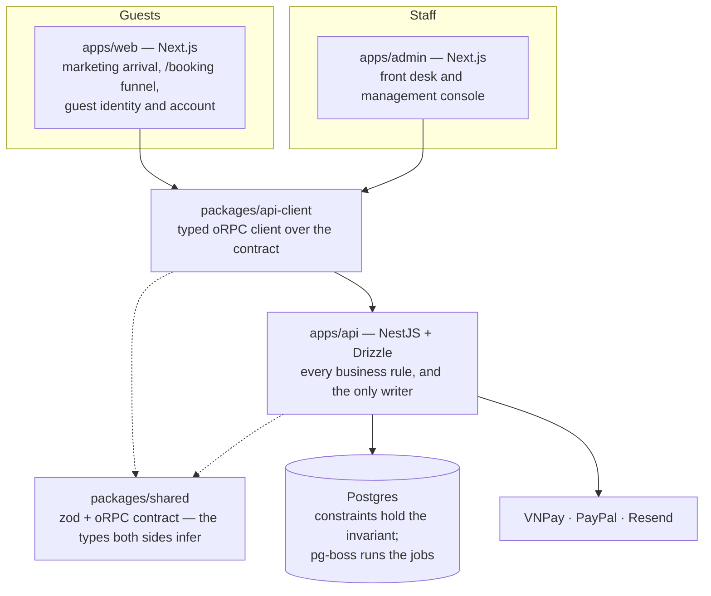

<div align="center">


**A property management system and booking engine for one resort — plus the marketing site that sells its rooms.**

[](https://github.com/2351010154/resort-management/actions/workflows/ci.yml)


</div>

Mariva has two audiences that never meet. A **guest** finds a free room on the public
site, holds it, pays online through VNPay or PayPal, and later manages the stay from an
account or a booking link. **Staff** — five roles, from housekeeping to admin — run the
property from a keyboard-first console: check people in, post charges, take payment,
hand over the shift, close the day, read the numbers. `GUEST` is a separate actor and
authentication realm, not a sixth staff role.

One database, one set of business rules, two front doors.

> [!NOTE]
> **Built for one property, as coursework, and not yet deployed.** The application
> layer is complete through shift handover, reporting and a second payment gateway; what
> remains is the hosting work in
> [`infrastructure.md`](docs/architecture/infrastructure.md). The
> [GitHub issues](https://github.com/2351010154/resort-management/issues) own open
> questions and blockers. Repository documentation records durable requirements,
> decisions and rationale; a documented target is not evidence that it has shipped —
> follow the evidence links to the migrations and tests.

## Contents

- [The invariant](#the-invariant)
- [Architecture](#architecture)
- [What's inside](#whats-inside)
- [Getting started](#getting-started)
- [Commands](#commands)
- [Quality gates](#quality-gates)
- [Scripts beyond the build](#scripts-beyond-the-build)
- [Documentation](#documentation)

## The invariant

Everything else here is ordinary software. This is not:

> **Two guests must never be sold the same room for the same night.**

A hotel sells inventory that is finite, dated, and worthless the day after. The usual way
to get this wrong is to check availability in application code — read, decide, write —
because two requests can read the same *"1 room left"* before either writes.

So the guarantee does not live in code. It lives in Postgres, in two layers:

| Layer | What it holds | What makes it safe |
| --- | --- | --- |
| **Type level** — what you sell | rooms sold per night, per room type | `CHECK (sold_rooms <= total_rooms)`. Two people racing for the last Deluxe: one commits, the other's transaction is **rejected by the database** |
| **Room level** — what you operate | which physical room, which date range | `EXCLUDE USING gist` — an overlapping stay on the same room is **not representable**, so no code path can store one, including a buggy one |

Guests book a *type* ("a Deluxe for three nights"); room 301 is chosen at check-in. That
separation is what makes room moves, maintenance closures and upgrades routine instead of
a crisis.

> [!IMPORTANT]
> Invariants live in the database, never in a service-layer check. Application code may
> not be the last line of defence for money or inventory. Migrations are plain `.sql`
> under `apps/api/src/database/migrations/` precisely so `btree_gist`, `EXCLUDE` and
> `daterange` stay in version control. The same rule carries the rest of the ledger:
> the folio is append-only, every write to a protected row names who made it, and a
> closed trading day is frozen once — all as constraints and triggers, not conventions.

The race itself is a test. `apps/api/test/booking-race.e2e-spec.ts` fires concurrent
bookings at one last room against a real Postgres and asserts exactly one wins, and CI
runs it on every push.

## Architecture



Three rules follow from the picture, and they are the ones worth defending:

- **One brain.** Front-ends never re-implement a rule. No business logic in a Next.js
  server action or route handler, and no front-end talks to the database. The one
  exception is a pricing band both sides apply — the API quotes against it and the
  funnel shows a total before the round trip — and it lives in `packages/shared` so
  there is still only one copy.
- **The contract is a package.** `packages/shared` holds the zod schemas and the
  `@orpc/contract` routes built from them; the API implements them through
  `@orpc/nest`, and both front-ends call them through `packages/api-client`. Break the
  contract and the build fails, not production.
- **`/booking` shares an origin with the marketing site but not its bundle.** The
  scrollytelling acts load `three`, `gsap` and `lenis`. The booking funnel does not, so
  a guest on the way to paying never downloads them. Route groups keep it that way, and
  `apps/web/scripts/check-bundle-budget.ts` runs after every `next build` and fails
  the build if any `(booking)` chunk carries them.

Dependencies point one way and never back up the chain:

```
app/  →  features/  →  components/ui/ + lib/  →  packages/*
```

A feature never imports another feature. When two need the same thing, the thing
graduates: to `components/ui/` if it is presentational, to `lib/` if it is
infrastructure, to `packages/shared` if it is a contract.

## What's inside

A pnpm workspace driven by Turborepo.

| Workspace | Boundary |
| --- | --- |
| [`apps/api`](apps/api/README.md) | NestJS 11 on Express 5, ESM. Every business rule, the only database writer, and the host of the pg-boss workers |
| `apps/web` | Public marketing arrival, the guest booking funnel, guest identity and account. Port 3000 |
| [`apps/admin`](apps/admin/README.md) | The staff console: front desk, housekeeping, folios, payments, shifts, rates, reports, settings, audit. Port 3002 |
| `packages/shared` | The contract: zod schemas, oRPC route definitions, money and stay-date types, and the pricing bands both sides apply |
| `packages/api-client` | The browser-to-API boundary — an oRPC client typed from the contract |
| `packages/tokens` | `tokens.css`, the palette and type scale all three surfaces share |

[`docs/architecture/repository-structure.md`](docs/architecture/repository-structure.md)
is the authority on what goes where and why, including the rule that the repository root
holds workspace configuration only — no logs, no downloaded assets. A directory that
exists but holds no code is a reserved boundary, not an oversight: an imported empty
module misrepresents the dependency graph.

**Two type distinctions the contract makes into compile errors**, because both are
otherwise the most common bug class in this domain:

- **Money is `bigint` VND.** No minor unit, no decimal library, `Intl.NumberFormat('vi-VN')`
  to display. PayPal cannot charge đồng, so a PayPal attempt records what was charged
  in USD and the rate it was converted at, and the ledger stays VND regardless.
- **A stay date is not an instant.** `CalendarDate` for the nights you sell,
  `ZonedDateTime` for the moments things happen. Mixing them is the off-by-one-night bug.

### The API

Fifteen domain modules under `apps/api/src/modules/`: identity and the two auth realms,
inventory, pricing, booking, guest, folio, payment, housekeeping, operations (shifts,
cash book, service catalog), reporting, notification, feedback, audit and system
configuration. Forty-seven committed migrations build the schema, and pg-boss runs the
timers from inside the same Postgres: hold expiry, the no-show sweep, the nightly room
charge posting, pre-arrival reminders, payment reconciliation and loyalty tier
recomputation. Outbound mail leaves through Resend, handed to the same queue, and a
process with no queue delivers it in-line rather than staying quiet.

### The guest surface — route groups in `apps/web`

The root layout carries only the document shell, the type families and the design tokens.
Anything reaching `three` / `gsap` / `lenis` lives under `app/(marketing)/`, so
`app/(booking)/` renders on the same origin without the WebGL bundle in its tree. Route
groups do not appear in URLs — `app/(marketing)/page.tsx` is still `/`.

The `(booking)` group is the *plain bundle*, and a screen belongs there because it must
not load `three`, not because it sells a room. It holds the funnel (`/booking`, then
details, payment and confirming for one hold), the five identity screens (sign-in,
sign-up, verify email, forgot and reset password), the signed-in account and stays, and
`/bookings/[reference]` — the link a guest who never signed up manages a stay from.

Google is the one social sign-in, and it is optional in development: the button is
offered either way, so production refuses to boot without the credentials.

### The staff console

`apps/admin` is a separate origin, keyboard-first, with no WebGL and no entrance
animation. One shell with role-filtered navigation and a command palette wraps the
desk's screens: dashboard, arrivals, departures, bookings, guests, rooms, housekeeping,
folios, payments, shifts, rates, finance, reports (revenue, performance, room status),
settings and the audit trail. Check-in and check-out are driven entirely from the
keyboard, and a Playwright suite proves it without ever calling `click()`.

## Getting started

### Prerequisites

| | |
| --- | --- |
| **Node 24** | Pinned in [`.nvmrc`](.nvmrc), `engines`, and CI together |
| **pnpm 11.1.2** | Pinned in the root `packageManager` field — `corepack enable` fetches it |
| **Postgres 17** | Local, in Docker. Neon is for deployed environments only |

```bash
corepack enable
pnpm install
```

`pnpm install` also installs the lefthook commit hook and fetches Playwright's browser
binaries; `pnpm-workspace.yaml` names every dependency allowed to run an install script,
and says why beside each one.

### Configure

Each front end needs one public variable; the API refuses to boot without a database URL
and two distinct secrets.

```bash
cp apps/web/.env.example apps/web/.env.local
cp apps/admin/.env.example apps/admin/.env.local
cp apps/api/.env.example apps/api/.env
```

Then generate the two secrets and put them in `apps/api/.env`:

```bash
openssl rand -base64 32   # BETTER_AUTH_SECRET
openssl rand -base64 32   # STAFF_JWT_SECRET
```

> [!IMPORTANT]
> `BETTER_AUTH_SECRET` and `STAFF_JWT_SECRET` must never hold the same value — one signs
> guest session cookies, the other signs staff access tokens, and sharing them would let
> one leak forge both realms.
>
> `NEXT_PUBLIC_API_URL` and the API's `WEB_ORIGIN` are two halves of one CORS pair. A
> mismatch fails sign-in as a CORS error rather than as a wrong password. The allowlist
> holds two origins and not one — `ADMIN_ORIGIN` is the console's half, defaulting to
> the console's local port in development and required in production, where a deploy
> that leaves it unset has every staff request rejected at the preflight.

Every variable the API reads is declared in `apps/api/src/config/env.ts` and parsed by zod
before the container is built. A missing or malformed one prints its name and exits 1 — it
never boots on a default nobody chose. Payment gateways, Google sign-in and Resend are
all optional locally and configured there when you need them; the VNPay and PayPal
sandboxes are the default, and flipping either to live credentials is a gated runbook
under [`docs/runbooks/`](docs/runbooks/).

### Database

Bring up Postgres, then apply the committed migrations:

```bash
docker run -d --name mariva-pg -p 5432:5432 \
  -e POSTGRES_PASSWORD=postgres -e POSTGRES_DB=mariva_dev postgres:17

pnpm --filter @mariva/api db:migrate
```

The first `ADMIN` cannot be created through the API, because creating staff accounts
requires a capability only an `ADMIN` holds. Create it from a shell — it prompts for the
password rather than taking it as an argument, which would put it in the shell history and
in `ps`:

```bash
pnpm --filter @mariva/api staff:create \
  --email owner@mariva.vn --name "Trần Minh" --role ADMIN
```

Then give the property something to sell. The seed builds the resort
[`property-and-tariff.md`](docs/architecture/property-and-tariff.md) describes — five
room types, forty rooms, twelve months of rates and five hundred synthetic stays — and it
converges rather than accumulates, so it can be run again:

```bash
pnpm --filter @mariva/api db:seed
```

Both scripts compile the API before they run, so the sequence above works on a clone
that has never been built.

### Run

```bash
pnpm dev
```

Turborepo fans the task out across every workspace that defines one: the web app on
<http://localhost:3000>, the API on <http://localhost:3001>, the console on
<http://localhost:3002>. To drive a single one:

```bash
pnpm --filter @mariva/web dev
```

`GET /health` executes `select 1` through the pool and returns 200 only after that
round-trip comes back — never a 200 with a body explaining that things are bad.

## Commands

Run from the repo root.

| Command | What it does |
| --- | --- |
| `pnpm dev` | Every app that defines a dev task |
| `pnpm build` | Turborepo build, respecting workspace dependencies. The web build ends with the bundle budget check |
| `pnpm lint` | Biome across the repo, then stylelint on the web app's CSS |
| `pnpm format` | Biome, writing in place |
| `pnpm typecheck` | Every workspace that owns a `tsc` pass |
| `pnpm test` | Vitest across the workspaces |
| `pnpm backlog:view` | Renders a local `plans/backlog.md` to HTML when one exists. `plans/` is untracked scratch, so a clone has neither |

The API's own commands — migrations, the seed, the Nest watch loop, the first-admin
script, the k6 latency profile — are in
[`apps/api/README.md`](apps/api/README.md#commands). The console's, including its
Playwright suite, are in [`apps/admin/README.md`](apps/admin/README.md).

## Quality gates

| Gate | Tool | Where it runs |
| --- | --- | --- |
| Format + typecheck | Biome, `tsc` | **Commit**, via lefthook. Formatting is applied and re-staged, not reported |
| Lint | Biome + stylelint | **CI** — a lint failure at commit time leaves the author nothing staged to fix |
| Typecheck | `tsc` per workspace | CI |
| Build | `next build`, `tsc` | CI. The Next apps' type check happens inside their build; the web build also enforces the bundle budget |
| Unit + integration | Vitest 4 | Every workspace. The API's suite runs against a real Postgres |
| Console keyboard and timing | Playwright | `apps/admin/e2e/`, against a running console, API and seeded database. Local; its config starts none of them |
| Visual baseline | Playwright scripts | `apps/web/scripts/capture-visual-baseline.mjs` and `compare-visual-baseline.mjs`, desktop and mobile, against a production build. Local — the baseline is untracked, so capture it before you can compare against it |

CI runs on every pull request and push to `main`: install with a frozen lockfile, then
lint → typecheck → test → build, with in-flight runs superseded per branch. The test step
runs against a Postgres 17 service container, so the constraints that hold the invariant
are proved where a regression can fail the build.

> [!WARNING]
> The API's tests need a **second** database and their own `apps/api/.env.test`. They
> apply the committed migrations and truncate every table they use, so they refuse to
> start when that file is missing rather than falling back to `.env` — which is how a test
> run empties somebody's development database. Locally that database listens on 5433,
> the port CI publishes its service container on, so one connection string serves both.

Two notes that will otherwise cost you an afternoon:

- **`apps/api` is ESM** (`"type": "module"`, `nodenext`). Relative imports need explicit
  `.js` extensions; CommonJS dependencies like `pg` are default-imported. This is forced,
  not stylistic — `@orpc/*` ships ESM only.
- **Nest under Vitest transforms with SWC, not esbuild.** Nest's DI reads constructor
  parameter types from `emitDecoratorMetadata`, which esbuild does not emit. Without the
  SWC plugin, every injected dependency arrives as `undefined`.

## Scripts beyond the build

A script serving one workspace stays in that workspace; `scripts/` at the root holds
only the repo-wide ones.

- **`apps/web/scripts/`** — the pipelines that produced the arrival's images and video,
  and the Playwright scripts that photograph acts against a running server. The asset
  pipelines read a source library outside the repo and are gitignored; the curation maps
  beside them, which say which frame became which slug, stay tracked. Captures land in
  `plans/reports/screenshots/`, untracked.
- **`apps/api/scripts/`** — `seed-demo-day.mjs` stages one convincing day of arrivals,
  departures and balances through the public contract, so the console has something to
  show; `replay-vnpay-ipn.mjs` delivers a correctly signed VNPay callback to a local
  API, the half of the payment flow a laptop cannot otherwise receive.
- **`apps/api/perf/`** — a k6 profile for the twelve-month availability calendar, the
  read the funnel opens on, against its p95 budget.
- **`scripts/shoot-thesis-figures.mjs`** — re-shoots the live console and funnel
  figures the coursework report embeds, with credentials taken from the environment.

## Documentation

Written as the system is built, not assembled at the end.

| Start here | For |
| --- | --- |
| [`docs/orientation.md`](docs/orientation.md) | What the system is, the invariant, and where to resume work |
| [`docs/README.md`](docs/README.md) | The **authority map** — which document owns which fact, and the precedence order when two disagree |
| [`docs/product-requirements.md`](docs/product-requirements.md) | Durable scope, business rules and acceptance criteria |
| [`docs/screens.md`](docs/screens.md) | Screen intent and navigation rationale, not delivery status |

| Design fact | Owner |
| --- | --- |
| Repository structure, dependency rules, module map | [`repository-structure.md`](docs/architecture/repository-structure.md) |
| Technology stack, versions, rejected options, spike evidence | [`tech-stack.md`](docs/architecture/tech-stack.md) |
| Roles and permissions | [`rbac-matrix.md`](docs/architecture/rbac-matrix.md) |
| Booking states and transitions | [`booking-state-machine.md`](docs/architecture/booking-state-machine.md) |
| Property facts, rates, cancellation grid, charge model, loyalty | [`property-and-tariff.md`](docs/architecture/property-and-tariff.md) |
| Hosting, database, storage, backups, payments, e-invoice, mail | [`infrastructure.md`](docs/architecture/infrastructure.md) |
| Order of operations for a change made by hand against a live environment | [`runbooks/`](docs/runbooks/) |

The architecture documents are authored **ahead** of the code that enforces them: change
the document first, then the implementation. Source, tests, schemas and workflows own
current behaviour; the documents point at them.

The Vietnamese coursework report is assembled from the documents above when it is
needed and is not kept here. It is a consumer of truth, never a source, and a stored copy
earns nothing but the chance to disagree with them.

### Vocabulary

The docs are written in hotel vocabulary. The short version:

| Term | What it means here |
| --- | --- |
| **Hold** | A booking that has reserved inventory but is not paid. Expires on a timer and gives the room back |
| **Folio** | The bill attached to one stay. **Append-only** — "editing an invoice" means adding a reversing line, never an `UPDATE` |
| **Night audit** | A nightly job: posts room charges, rolls the business date forward, freezes a snapshot. Reports read snapshots, so last month's numbers never change |
| **Business date** | The hotel's day, which is not midnight-to-midnight |
| **Shift** | The drawer a payment is counted into. Cash is handed over between shifts, and the property keeps a cash book of its own |
| **Housekeeping status** | `CLEAN / DIRTY / INSPECTED / OUT_OF_ORDER`, completely separate from occupancy. A checked-out room is not sellable until inspected |
| **Occupancy / ADR / RevPAR** | The three numbers a hotel is actually judged on. Gross revenue alone says nothing |

Two enumerations worth knowing before reading any module:

- **Booking states**, six and no more: `HELD` → `CONFIRMED` → `CHECKED_IN` → `CHECKED_OUT`,
  with `CANCELLED` and `NO_SHOW` terminal. There is no `EXPIRED` — an abandoned hold and a
  guest cancellation differ in *reason*, not in what the system must do, so `CANCELLED`
  carries a reason code and the reason drives the penalty.
- **Roles**, in two realms no single token opens: `GUEST` on Better Auth;
  `RECEPTIONIST`, `HOUSEKEEPING`, `ACCOUNTANT`, `MANAGER`, `ADMIN` on Passport-JWT. A
  route with no `@RequiresCapability()` declaration is unreachable by everyone — the guard
  is fail-closed, and the one escape hatch takes a written reason.
