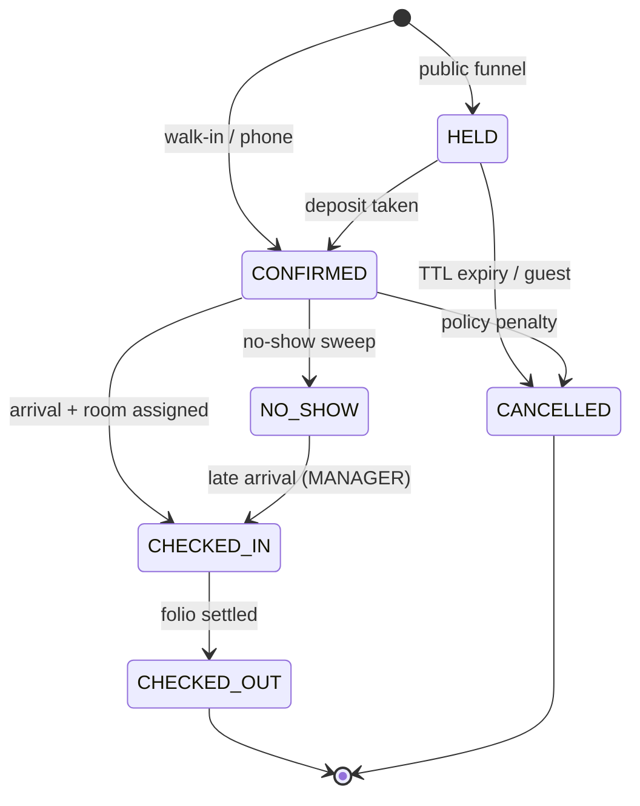

# Booking state machine

Authority for the transition table the code enforces, the illegal-transition
tests in P2, and the generated state diagram. Change this file first.

**Status:** proposed defaults. **Two** decisions are the owner's call, each
marked ⚑ at the guard it governs and listed in §7. §7 is the authority for the
number; the trailing note there is a pointer to `D3`, not a third decision.

## 1. States

Six, and no more. Variants that look like states are reason codes instead.

| State | Meaning | Inventory | Room assigned |
|---|---|---|---|
| `HELD` | Cart or tentative booking, TTL running | Consumed, all nights | No |
| `CONFIRMED` | Deposit taken or staff-confirmed | Consumed, all nights | Optional |
| `CHECKED_IN` | Guest in house | Consumed, remaining nights | **Yes** |
| `CHECKED_OUT` | Stay complete, folio closed | Consumed nights spent | Historical |
| `CANCELLED` | Terminal, did not occur | Released | No |
| `NO_SHOW` | Arrival night passed without check-in | Arrival night retained, rest released | Arrival night only |

**Why a no-show keeps a room.** The room follows the counter, and the counter
keeps the arrival night — it is the night the no-show charge is levied against,
and a night the property is charging for is not a night it has resold. Cutting
the hold back to that one night rather than dropping it keeps the two inventory
layers saying the same thing: a room shown occupied for the night being paid for,
sellable for every night after it. It is also what makes §2's "it fails if the
room was resold" a sentence the code can enforce — without a hold to collide
with, `room_assignment_no_double_booking` has nothing to refuse and a reinstated
guest walks into an occupied room.

**Why no `EXPIRED` state.** An abandoned hold and a guest cancellation differ in
*reason*, not in what the system must do. Both release inventory and end the
booking. `CANCELLED` carries a reason code — `HOLD_EXPIRED`, `HOLD_REPLACED`,
`GUEST_REQUEST`, `STAFF_ERROR`, `PAYMENT_FAILED`, `OVERBOOK_WALK`,
`FORCE_MAJEURE` — so the distinction is recorded without a seventh state, which
would buy nothing and double the transition table.

**What the reason code is, and is not.** It is the audit record of *why* the stay
ended, and it prices nothing. `property-and-tariff.md` §4's grid is keyed on the
event — cancellation against its deadline, no-show, early departure — and the
rate plan, and it has no reason column; `cancellation-calculator.ts` mirrors that
exactly and takes no reason. Setting a cell aside is an authority rather than a
reason: waiving any cell is `MANAGER` or above (§4 again, and `rbac-matrix.md`
§5 decision 2), granted through `booking.cancel-waiver` and recorded on the
booking as `penalty_waived_at` and `penalty_waived_by`. The two are orthogonal on
purpose — a manager may waive a `GUEST_REQUEST`, and a `STAFF_ERROR` nobody
waived is still priced by the grid — because a reason code the guest supplies
would otherwise decide what the property charges.

The instant a cancellation arrived is `cancelled_at`, written by the database in
the transaction that ends the stay. §4's free window turns on it against an 18:00
deadline, so it is a column of its own rather than a reading of `updated_at`:
`CANCELLED` is terminal but the row is not, and any later touch would move a
cancellation across that deadline.

## 2. Transitions

`✔` legal, `✘` rejected with `409 IllegalTransition`.

| From ↓ To → | `HELD` | `CONFIRMED` | `CHECKED_IN` | `CHECKED_OUT` | `CANCELLED` | `NO_SHOW` |
|---|:-:|:-:|:-:|:-:|:-:|:-:|
| *(new)* | ✔ | ✔ | ✘ | ✘ | ✘ | ✘ |
| `HELD` | — | ✔ | ✘ | ✘ | ✔ | ✘ |
| `CONFIRMED` | ✘ | — | ✔ | ✘ | ✔ | ✔ |
| `CHECKED_IN` | ✘ | ✘ | — | ✔ | ✘ | ✘ |
| `CHECKED_OUT` | ✘ | ✘ | ✘ | — | ✘ | ✘ |
| `CANCELLED` | ✘ | ✘ | ✘ | ✘ | — | ✘ |
| `NO_SHOW` | ✘ | ✘ | ✔ | ✘ | ✘ | — |

Three entries deserve their reason:

- **`CHECKED_IN` → `CANCELLED` is illegal.** The guest is in the building; the
  stay happened. Shortening it is *early checkout*, which posts a policy charge
  and settles a folio. Allowing cancellation here would let someone erase a stay
  that consumed a room and produced revenue.
- **`NO_SHOW` → `CHECKED_IN` is legal.** A guest landing at 02:00 after the
  sweep wrote them off is an ordinary event, not a data-entry error. `MANAGER` only,
  and it fails if the room was resold. The room may be named at the transition,
  and must be when the booking is holding none — §1 makes an assignment optional
  in `CONFIRMED`, and §5 makes assigning one legal from `CONFIRMED` and
  `CHECKED_IN` only, so a stay written off without a room has no other door to
  one. The same door takes a guest whose own room went out of order overnight.
- **Direct creation as `CONFIRMED`** is how the front desk books a walk-in or a
  phone reservation. Only the public funnel starts at `HELD`.

## 3. Transition effects

| Transition | Inventory | Money | Other |
|---|---|---|---|
| → `HELD` | `sold_rooms += 1` per night | None | TTL timer starts; first sighting recorded |
| `HELD` → `CONFIRMED` | Unchanged | Deposit posted if taken | Confirmation email |
| `HELD` → `CANCELLED` | Release all nights | None — the transition posts nothing | Reason `HOLD_EXPIRED` when the hold runs out — on either of the two clocks below — and `HOLD_REPLACED` when the same browser takes another room |
| `CONFIRMED` → `CANCELLED` | Release all nights | None — §4's penalty and any refund are a later act on the folio | Reason code required, always |
| `CONFIRMED` → `CHECKED_IN` | Unchanged | First room-night posted by the room-charge sweep, not at check-in | Room assignment mandatory; registration record written |
| `CONFIRMED` → `NO_SHOW` | Release nights **after** the arrival night | No-show charge per policy | Room hold cut back to the arrival night; written by the hourly no-show sweep |
| `CHECKED_IN` → `CHECKED_OUT` | Release unspent nights | Folio must balance; the transition itself enqueues nothing | Room → `DIRTY`, unless it is `OUT_OF_ORDER`; the e-invoice follows the folio's close |
| `NO_SHOW` → `CHECKED_IN` | Re-consume remaining nights, fail if unavailable | Reverse the no-show charge | `MANAGER` only; room may be named, and must be when none is held |

**What → `HELD` refuses, beyond the counter.** The funnel's door is the only
unauthenticated write that consumes inventory, so the effect above is reachable
by a stranger, repeatedly, at no cost. Three things bound it, and the first is
the only one that is merely a rate:

| Bound | Unit | Refusal |
|---|---|---|
| Requests per caller | 30 in 10 minutes, per address or IPv6 /64 | `429`, naming the window as the wait |
| Live holds per caller | 3 outstanding, counted in SQL off `booking.held_by` | `429`, naming the hold TTL as the wait |
| Anonymous share of a night | `max(2, ⌊remaining ÷ 2⌋)` per night per room type, counting holds with no account behind them | `429`, naming the night, pointing at signing in, and naming the TTL for a guest who would rather not |

The second exists because a rate cannot say how much is outstanding: a caller
pacing themselves under the limit can still stand on any number of rooms, and a
counter that lives in one process forgets what it allowed when that process
restarts. `held_by` is a salted digest of the caller and never an address; it is
written only while the row is `HELD` and cleared by every transition out of it,
so a stay that was confirmed or cancelled stops counting against whoever held
it.

The third bounds how much of a night can be withdrawn from sale by people the
property cannot contact. A signed-in guest is outside it entirely — an account
is a verified address and a stay history, so that hold can be chased — which is
why the refusal invites the guest to sign in rather than reporting a sell-out.
The floor of two is deliberate: a plain half-of-what-is-left rule would turn away
the second genuine guest of the evening on a nearly-full night, which is the
busiest and most valuable moment the property has.

All three refuse **before** the stay is priced, before a night is consumed and
before a reference is spent, so a refused call leaves nothing behind. None of
them is the oversell guarantee: that is `type_inventory_sold_at_most_total`, and
it is the only one of these that cannot be raced.

**What the three sentences may say, and what they may not.** They share a status,
so the sentence is the only thing that tells a guest which bound answered and the
only thing they can act on. Two rules hold across all of them.

- **Claim nothing the reader cannot check.** Once a room pick became a move, one
  browser holds one room however many types it compares — so the second bound is
  no longer reachable by a person shopping, and the caller who meets it is
  several strangers behind one router. The refusal therefore states that holding
  is closed for that connection rather than telling the reader they hold three
  rooms and should drop one, which for that reader is false and impossible to
  act on. The rate says *attempts* for the same reason: it counts asking,
  including the asks the caps below it refuse, so its reader has often held
  nothing at all.
- **Name the wait, in minutes.** Every bound here clears on a figure the property
  configures — the limiter's window, and the hold TTL for the other two, since
  both count only live holds. The TTL is the floor of that wait and not a ceiling
  on it: a hold whose guest has been sent to a gateway carries the deadline the
  payment window below pushed out, so a caller waiting on that one waits a TTL
  and a window, and another window each time an attempt is opened. The sentence
  still quotes the TTL, because that is the wait faced by a caller who is paying
  for nothing and it is the figure the funnel's other refusals already name. "A
  few minutes" against a ten-minute window sends the guest back to the same refusal.
  The figures are read from configuration at the point the sentence is built and
  are never written into copy, in the API or in the funnel.

The share cap is the one refusal that describes anything beyond the caller, and
it earns it: the escape it offers is signing in, and an invitation with its
reason removed is one a guest has no cause to accept. It still describes only the
*anonymous* share, never what the property has left, so it cannot be read as a
sell-out. The `apps/web` funnel prints all three verbatim and adds its own
sentence only when a refusal arrived with none — `stay-funnel.ts` tells a wait
from a fault by the status, never by the words.

**Picking a room is a move, so → `HELD` releases the room the browser was on.**
A guest comparing three room types took three holds and gave none of them back,
which is one person meeting a cap written for callers who are not shopping — and
it cost the property up to three rooms per abandoned funnel session for a full
TTL. So `createHold` releases the hold the caller's own cookie names, in the same
transaction, with reason `HOLD_REPLACED`.

**Four conditions, all required, all read under the released row's lock:** the
cookie names it, `held_by` matches the caller now asking, the stay has not been
attached to an account, and the row is still `HELD` with no payment attempt on it
still `PENDING`. Anything else is left alone, silently — the new hold succeeds
either way, and the room the guest did not come back to runs out its TTL. Six
things make that safe:

- **The cookie decides which hold, and the caller digest is a second lock.** The
  credential `booking-token.service.ts` issues is signed, `httpOnly` and names
  one stay, and its path is already `/bookings` — so it arrives on this route
  with nothing added to the wire, and a booking id is never something a caller
  may *send*. `held_by` must match as well, so a cookie copied to another network
  releases nothing.
- **Never a stay somebody has claimed.** The cookie is verified by arithmetic and
  reads no row, so it goes on naming a stay long after the guest gave it up — and
  a stay is given up by being attached to an account, which happens in any state
  and does not wait for the hold to end. Without `anon_access_revoked_at is null`
  a guest who claimed their stay in a lobby browser leaves a cookie that releases
  their room for the next person on that address, whose digest matches because
  the digest is of the address.
- **Take first, release second.** A pick the property refuses — sold out, or past
  the anonymous share of the night — leaves the guest holding the room they had,
  with their cookie still naming it. The caller counts two live holds for the
  length of the transaction, which is what the headroom in the cap of three is
  for; a cap of one would make this ordering impossible.
- **Only a row that is still `HELD`, read `for update`.** A stay that has been
  paid for is `CONFIRMED` and one the sweep reached is `CANCELLED`, and the lock
  is what stops a payment landing between the read and the release.
- **Never a hold with money in flight.** The state answers for money that
  arrived; a `PENDING` attempt is money on its way. A guest sent to the gateway
  is in a banking app with the funnel tab still open behind it, so comparing one
  more room is ordinary — and releasing that room would sell it while they are
  paying for it. So a hold carrying a `PENDING` attempt is never released here,
  the new hold is taken anyway, and the guest briefly holds two rooms, which the
  cap of three absorbs. Refusing the pick instead would be refusing a guest for
  changing their mind.
- **It reaches no charge.** The release goes through the same `cancel` the TTL
  sweep calls, which posts no money at all; §4's charge is `folio.refund-policy`,
  raised by a manager against a folio an unpaid hold does not have. A room change
  that billed a guest is the one failure this transition must not have, and
  `HOLD_REPLACED` is refused on the desk's cancellation route for the same reason
  `HOLD_EXPIRED` is: neither is a reason a person may claim.

The reason is its own code rather than `GUEST_REQUEST` because nobody cancelled
anything. Counted as a guest cancellation it would make the property's
cancellation rate a function of how many room types its guests compare.

**A hold ends at the earlier of two clocks, and the second one is the guest.**
The TTL is the ceiling a hold is taken under: it says how long a room may be held
on the strength of somebody picking it. What it cannot say is whether anybody is
still there — so a guest who closed the tab
thirty seconds into a ten-minute hold cost the property the other nine and a
half, and on a night at the anonymous share cap that is the room the next guest
is turned away from. The funnel now says every twenty seconds that it is still
open (`POST /bookings/holds/{bookingId}/presence`), and `hold-expiry-sweep.ts`
releases a hold at `min(hold_expires_at, last_seen_at + BOOKING_HOLD_GRACE_SECONDS)`.
The grace is two minutes by default and is configuration, beside the TTL.

Worst case for a funnel session abandoned **before** checkout goes from a TTL
plus the sweep's cadence — eleven minutes — to about three. A closing tab
shortens that again with a `sendBeacon` that marks its departure, and marking is
all it does: the sweep still decides, so there is one release path rather than
one per caller. A checkout abandoned at the gateway is the other case and it is
longer, not shorter: opening an attempt pushes the deadline out to the payment
window below, and presence is not allowed to take a hold with money in flight —
so that room comes back a sweep tick after the window, not after the grace.

**Three rules hold it in place, and none of them is optional.**

- **Presence may only ever shorten a hold, never extend it.** It is a `min` and
  not a `max`. A tab left open with a ping running holds its room for the TTL and
  not a second longer, the same as a tab nobody is watching — otherwise a browser
  saying "still here" forever would pin a room indefinitely, which is precisely
  the abuse the three bounds above exist to prevent. Nothing on the presence route
  writes `hold_expires_at`; the payment window below is the one thing that does.
- **Presence never releases a hold with a `PENDING` payment attempt.** A guest
  paying by QR code is in a banking app with the funnel tab backgrounded or
  closed, which is the likeliest moment for presence to be absent and the worst
  moment to resell their room. So a hold that is due *only* because nobody has
  said they are there is left alone while an attempt against it is still
  `PENDING`, and it runs out its TTL like any other. "In flight" has one
  definition, shared with the room a guest moves off.
  The TTL branch is deliberately **not** guarded the same way. A hold whose TTL
  has passed is cancelled whether or not an attempt is open: a callback that lands
  after the room has gone is answered by `confirmPaidHold` and by `FR-PAY-05`'s
  hourly reconciliation, and a sweep that skipped every stay with an open attempt
  would hold a room for as long as one sat unfinished. What keeps a paying guest
  their room is the deadline itself moving — the payment window below, which the
  sweep then reads like any other expiry rather than being exempted from.
- **Presence is cooperative and is never a defence.** The door is public, so
  anybody automating the funnel simply never says it and keeps their rooms for
  the full TTL exactly as they do today. Nothing was relaxed in exchange:
  `CONCURRENT_HOLDS_PER_CALLER`, the anonymous share and the rate in front of the
  hold are all unchanged, and "abandoned holds release themselves now" is not an
  argument for widening any of them. It does the work only for the callers who
  choose to send it, which is every real guest and no attacker.

**Opening a payment attempt moves the deadline out, and it is the only thing that
does.** The TTL starts when a room is picked and paying is the last thing that
happens under it, so a guest who reaches checkout near the end of it is sent to a
bank app with less time than the round trip takes — and the sweep cancels the stay
mid-payment, after which the money lands on a room that is back on sale. So
`payment.service.ts` asks `BookingService.extendHoldForPayment` to push
`hold_expires_at` out to `BOOKING_PAYMENT_WINDOW_MINUTES` from now, in the same
transaction that writes the attempt. Fifteen minutes by default, bounded 1–60, and
longer than the TTL on purpose: the TTL is time spent choosing a room and this is
time spent paying. It is `greatest(hold_expires_at, now() + window)` scoped `where
state = 'HELD'`, so it can only ever lengthen a hold, and a stay that is no longer
held — a balance collected from a guest in the building, a hold the sweep already
took — is a silent no-op rather than a `booking_hold_expiry_exactly_when_held`
violation aborting the attempt. Both doors extend, because a gateway is no faster
for a receptionist.

What it costs is a hold that can outlive one TTL: a checkout nobody finishes holds
the room for the window from the moment it was opened, and a caller who keeps
opening attempts keeps renewing it. That is bounded by `CONCURRENT_HOLDS_PER_CALLER`
and the anonymous share rather than by a ceiling on the extension itself — a hard
ceiling is scope the property has not taken, and the window is configuration for
that reason.

The route is a guest row of its own (`booking.presence-own`), opened by the same
booking-scoped credential as the read, the contact and the cancellation, scoped
to one stay by the same `where` clause, rate-limited on its own policy — sharing
the hold's would spend on heartbeats the allowance a guest needs to book — and
behind `json-request.guard.ts`, because a departure a cross-site page could send
would put a stranger's room back on sale. It is mounted under `/bookings` because
that is the cookie's path; anywhere else and every ping arrives anonymous.

A returning guest gets their **search** back and not their hold: dates, party,
plan and room type are kept in `localStorage`, the room went back on sale because
nobody was standing on it, and the return visit takes a fresh hold against
whatever the property actually has left. Nothing identifying is stored — no
contact pair, no booking reference — which is the same decision
`contract/booking.ts` records about where contact belongs.

**Who makes `HELD` → `CONFIRMED`.** Two callers, and the funnel's is not the
desk's. The desk confirms by hand under `booking.write`. A guest paying online
never touches that route — no guest holds the capability — so the transition is
made by the gateway callback that takes the money, in the same commit as the
payment and the folio line (`payment.service.ts`). That is what the caption
"deposit taken" means in practice, and it is not optional: a paid stay left
`HELD` is one the TTL sweep above cancels within a minute, releasing a room the
guest has paid for.

Only a hold moves. Money reaching a stay that is already `CONFIRMED` or
`CHECKED_IN` is a balance rather than a deposit, and a callback against one
posts the payment and changes no state — a refusal there would roll back money
the gateway has already taken. The same is true of a callback that arrives after
the sweep has cancelled the hold: the payment posts, the cancellation stands, and
the hourly reconciliation is what surfaces the pair.

**From an anonymous stay to a claimed one.** The funnel's door takes no account,
so the confirmation mail is where ownership is offered. It carries single-use
links rather than a password — `booking_link` rows, `STAY_REISSUE` to re-mint the
stay's own credential and `ACCOUNT_CREATE` to open an account for the address the
mail went to, each checked against its expiry when it is spent
(`0028_booking_link_and_anonymous_revocation.sql`). Attaching a stay to an account
gives up its anonymous credential in the same transaction and in every state
(`anon_access_revoked_at`, `BookingService.attachToAccount`), because the cookie
is verified by arithmetic and would otherwise go on opening a stay that now has an
owner. That column is the third of the four conditions above, and it is why a stay
somebody has already claimed is mailed no link at all: a re-issue would advertise
a credential nobody can spend, and an account link would offer the account the
stay already has.

## 4. Guards

Rejections that are not about the state pair.

| Guard | Applies to | Rejects when |
|---|---|---|
| Arrival window | → `CHECKED_IN` | Business date < arrival date and early check-in disabled ⚑, or business date > departure date |
| Room required | → `CHECKED_IN` | No assignment, or assignment violates the `EXCLUDE USING gist` constraint |
| Room ready | → `CHECKED_IN` | Housekeeping status is not `CLEAN` or `INSPECTED` ⚑ |
| Folio settled | → `CHECKED_OUT` | Balance ≠ 0 and no approved deferred settlement |
| Arrival reached | → `NO_SHOW` | Business date < arrival date — §1 defines the state as an arrival night that passed, and a guest cannot have failed to arrive for a night the property has not got to. On the arrival date it passes, which makes this a floor on what the desk may do rather than a schedule: under the 04:00 rollover a job run in the small hours after the night of `D` still reads business date `D`. `no-show-sweep.ts` takes the stricter half — strictly before the business date — because nobody is watching it |
| Arrival not already past | → `HELD`, → `CONFIRMED` | Arrival date < business date, at both creation doors. The arrival window above governs check-in and would never see it. Arriving *today* passes: that is the walk-in this system exists to take |
| Inventory available | → `HELD`, → `CONFIRMED`, extend, reinstate | `sold_rooms > total_rooms` — enforced by the `CHECK`, surfaced as `409` |
| Idempotency | every transition | Same transition already applied; return the current state, do not error |

## 5. Operations that do not change state

These are where most real front-desk work happens. Legality is per state, and
each is a separate endpoint with its own `@RequiresCapability()` declaration.

| Operation | Legal in | Notes |
|---|---|---|
| Assign / reassign room | `CONFIRMED`, `CHECKED_IN` | Never moves a different checked-in guest |
| Room move | `CHECKED_IN` | New assignment row; old one closed at today's date; the vacated room goes to `DIRTY` |
| Extend stay | `CONFIRMED`, `CHECKED_IN` | Needs inventory for the added nights; fails cleanly |
| Shorten stay / early departure | `CHECKED_IN` | Releases nights, posts the early-departure charge |
| Change room type (upgrade) | `CONFIRMED`, `CHECKED_IN` | Inventory moves between types atomically; a checked-in guest's old room goes to `DIRTY` |
| Change rate | `CONFIRMED`, `CHECKED_IN` | Below the plan price is `MANAGER` only |
| Post charge / payment | Not gated on booking state | The gate is the folio's own: an `OPEN` account takes lines and a `CLOSED` one refuses them. Deposits post pre-arrival |
| Quote a cancellation | Every state §2 gives a `CANCELLED` from | `GET /bookings/mine/{reference}/cancellation-quote` — §4's grid priced and not posted, refused from anywhere a cancellation could not go so no figure appears beside a button that does nothing |
| Add or edit guest details | all but `CANCELLED` | |
| Name the contact on a hold | `HELD` only | The guest's own, from the funnel's review screen — see below |
| Say the hold is still open | `HELD` in effect, every state in fact | The presence mark is accepted on any stay of the caller's own and means nothing off a hold; refusing it would answer a guest whose payment landed a moment ago with "no booking of yours has that id" |

**Who the confirmation goes to is named while the stay is still a hold, and only
then.** The funnel takes the room first and asks who is taking it on the review
screen, one press before the gateway — a hold that expires unpaid is inventory
coming back, and the property has nothing to send anybody about it. Past `HELD`
the address stops being editable through that door: it is what a confirmation was
sent to and what the desk matches a guest against at check-in, so a route that
could still rewrite it would let a booking's paper trail be edited after the fact.
A later correction is the desk's, through *Add or edit guest details*, where the
change is recorded as the desk's act.

**Handing a vacated room back.** A move and a checked-in upgrade both leave a
slept-in room nobody is returning to, so both set it `DIRTY` — the same effect §3
gives check-out, and for the same reason: the property is not judging how dirty
the room is, it is recording that somebody was in it. Two rooms are left alone.
One the guest is already in, since a move naming it vacates nothing. And one that
is `OUT_OF_ORDER`: writing `DIRTY` clears the note with it, so a guest moved out
*because* the shower failed would take the reason for the withdrawal with them
and leave a room nobody has repaired one cleaning round from the next arrival.

## 6. Diagram

Source for the academic deliverable. Generate from the table in §2 rather than
maintaining it by hand.

## 7. Decisions still the owner's

**Two.** This list is the count every other document quotes.

1. **Early check-in** — allowed before the arrival date, or hard-blocked?
   Assumed blocked. `BOOKING_EARLY_CHECK_IN_ENABLED`, default off.
2. **Check-in into a `DIRTY` room** — some properties permit it, one check-in at
   a time, on a manager's override. Assumed blocked outright.
   `BOOKING_DIRTY_ROOM_CHECK_IN_ENABLED`, default off.

Both flags exist as of the check-in guard and are declared in `config/env.ts`.
They are the switch, not the decision: the defaults above are still what this
document assumes and not what an owner has chosen, and the flag is what makes
choosing otherwise a line rather than a guard.

The second flag is a **stand-in, not the mechanism**. An override is granted per
check-in, to a person, and recorded: `booking.check-in.override`, `MANAGER` and
above, a capability separate from `booking.check-in` because `rbac-matrix.md` §2
makes policy and override separate endpoints rather than one endpoint with a
check inside it. A property-wide environment variable is none of those things —
it says yes to every check-in at once and records nobody. `M4` ships it anyway
because the capability has no row in that matrix's §3 and no table exists to
write the approval into, which is the same missing pair that keeps §4's "no
approved deferred settlement" clause out of the check-out guard. Both land when
the audit record does.

Whichever grants it, it relaxes `DIRTY` and **only** `DIRTY`. `OUT_OF_ORDER` is
refused whatever it says, because `housekeeping-status.ts` files that status as a
room that cannot be occupied at all rather than one that is not ready yet — a
different question from the one asked here, and admitting a guest into a room
with a fault in it is not an answer to this one. The guard refuses the two with
different codes, `ROOM_NOT_READY` and `ROOM_OUT_OF_ORDER`, so the desk can call
housekeeping about the first and move the guest out of the second.

Not a decision here: the no-show charge amount and the cancellation deadline
grid. They are not state-machine questions, but the transitions above cannot be
tested without them — tracked as `D3` in `plans/backlog.md` §1.

## 8. What a booking stores about its price

**Settled.** A booking freezes the price it was quoted; it never re-derives one.

The inputs a price is computed from — the rate calendar, a plan's percentage,
its breakfast figure, the property's extra-person rate — are all rows the RBAC
matrix lets a manager edit. A booking recording only its dates, type and plan
code would hold a *recipe*, and re-running that recipe after any of those moved
answers with a number the guest never agreed to: a folio that contradicts the
confirmation, a refund against a rate nobody saw, and `M9`'s ADR computed off
today's tariff rather than the one that was sold.

So `booking` carries the agreed stay total and the three inputs that produced
it, and `booking_night` carries one row per night at the calendar price it was
sold at. Two consequences worth stating:

- The nights hold the **calendar** price, before the plan's percentage. §5 of
  [`property-and-tariff.md`](property-and-tariff.md) forbids rounding inside a
  calculation, and the pricing path honours it by summing the nights and
  dividing once over the whole stay. A stored per-night *adjusted* figure would
  divide per night, and the stored nights would then fail to sum to the stored
  total by a few đồng.
- A per-night figure is required rather than convenient. §4's grid charges "the
  first night" and refunds "the remaining nights at 50%", and neither may be
  approximated by dividing a total by a count when a weekend night costs more
  than a Tuesday.

Nothing above is a charge. `M4` computes cancellation, no-show and early-
departure amounts and persists none of them; the folio that posts them is `M6`.
