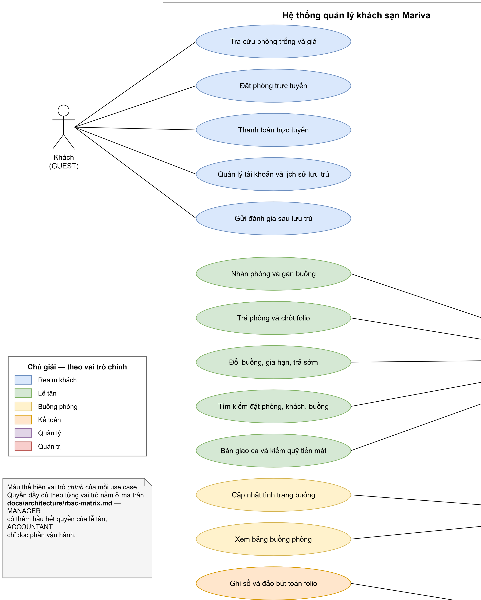

# Chương 2 — Phân tích yêu cầu

> ⛔ **OUTDATED / KHÔNG TIN CẬY — đánh dấu 2026-08-01.** Toàn bộ `docs/bao-cao/`
> đã trôi khỏi mã nguồn và tài liệu canonical. Không trích dẫn tệp này làm nguồn,
> không sửa mã hay tài liệu theo nó, không coi nó là bằng chứng đã triển khai.
> Lấy sự thật từ [`docs/README.md`](../README.md) (bản đồ thẩm quyền) rồi tới mã
> nguồn, test, schema và workflow CI. Chỉ viết lại chương này khi đang chủ động
> biên soạn báo cáo, và chỉ bằng bằng chứng đọc trực tiếp.
> *(EN: this coursework report is stale and untrusted — do not use it as a source
> of truth for the codebase.)*

## 2.1 Yêu cầu chức năng từ đề bài

Mười hai gạch đầu dòng, phát biểu lại ở dạng kiểm chứng được.

| # | Yêu cầu | Phát biểu kiểm chứng được |
|---|---|---|
| 1 | Phân quyền ≥ 3 mức | Năm vai trò nhân viên: `RECEPTIONIST`, `HOUSEKEEPING`, `ACCOUNTANT`, `MANAGER`, `ADMIN`, cộng principal `GUEST` ở realm riêng. Mọi route đều có guard; ma trận được tài liệu hoá và có test |
| 2 | Loại phòng và thuộc tính | Loại (Standard/Deluxe/Suite/VIP) với cấu hình giường, diện tích m², hướng nhìn, ban công, tiện nghi, sức chứa tối đa, ảnh. Buồng thuộc về một loại, mang số và tầng |
| 3 | Tài khoản khách | Đăng ký/đăng nhập, hồ sơ, dữ liệu giấy tờ, hạng VIP, điểm tích luỹ, lịch sử lưu trú của chính mình |
| 4 | Phản hồi sau lưu trú | Gắn với một booking đã `CHECKED_OUT` |
| 5 | Hiển thị phòng trống | Còn/hết theo khoảng ngày, cho cả kênh công khai và quầy lễ tân |
| 6 | Tìm kiếm | Theo số buồng, loại, trạng thái, khoảng ngày, tên/điện thoại khách |
| 7 | Báo cáo có biểu đồ | Doanh thu và tình trạng buồng theo ngày/tháng/quý/khoảng tuỳ ý |
| 8 | Bàn giao ca | Gồm cả phí dịch vụ phát sinh trong ca (giặt là, ẩm thực) |
| 9 | Nhật ký kiểm toán | Mọi thay đổi booking, huỷ kèm lý do, sửa/huỷ hoá đơn. Ai, khi nào, trước → sau |
| 10 | Xuất Excel | Dữ liệu quản lý đặt phòng |
| 11 | Thu chi | Có phân loại |
| 12 | Thanh toán trực tuyến | Tài khoản merchant thật. VNPay tại P3; MoMo có điều kiện tại P3.5 |

**Về gạch đầu dòng 12.** Cả hai cổng thanh toán đều nằm sau một cổng nội bộ duy
nhất `PaymentGateway`. Yêu cầu của đề bài đóng lại bằng **một** cổng chạy
production. MoMo có thể không bao giờ được xây và gạch đầu dòng vẫn đóng — chi
tiết ở chương 3 §5.

## 2.2 Yêu cầu bổ sung cho một cơ sở vận hành thật

Mười một yêu cầu dưới đây không có trong đề bài. Chúng không phải phần thêm nếm;
chúng là tường chịu lực.

| # | Yêu cầu | Vì sao bắt buộc |
|---|---|---|
| 13 | **Engine tồn kho khả dụng** | Tồn kho theo loại theo khoảng ngày, giữ chỗ an toàn với tương tranh, đặt trùng **bất khả thi về mặt cấu trúc** (ràng buộc DB, không phải kiểm tra ở tầng ứng dụng). Phần khó nhất; đề bài bỏ trống |
| 14 | **Rate plan và mùa vụ** | Giá cơ bản theo loại theo ngày; ghi đè cuối tuần/lễ/mùa; số đêm tối thiểu; chính sách huỷ. "Giảm giá, khuyến mãi" của đề bài chỉ là một lát mỏng của việc này |
| 15 | **Máy trạng thái vòng đời booking** | Sáu trạng thái, chuyển trạng thái bất hợp lệ bị từ chối. Chi tiết ở chương 5 §4 |
| 16 | **Trạng thái buồng phòng** | `CLEAN` / `DIRTY` / `INSPECTED` / `OUT_OF_ORDER`, **trực giao** với tình trạng có khách. Khách trả phòng ≠ buồng bán được ngay |
| 17 | **Folio / sổ ghi phí** | Sổ theo từng booking: tiền buồng + dịch vụ + thuế; VAT và phí phục vụ là các dòng riêng; đặt cọc, hoàn tiền. Thuế suất và việc VAT có tính trên phí phục vụ hay không là cấu hình đang chờ kế toán trả lời bằng văn bản. Huỷ hoá đơn = bút toán đảo, không bao giờ là xoá |
| 18 | **Luồng hoá đơn điện tử theo kết luận thuế** | **Nghị định 70/2025/NĐ-CP** nêu *khách sạn*, nhưng phạm vi áp dụng với pháp nhân và mã ngành vận hành Mariva chưa được xác nhận. Nếu đại lý thuế xác nhận áp dụng, màn hình trả phòng là máy tính tiền và cần chữ ký số HSM; nếu không, kết luận bằng văn bản của đại lý thuế quyết định loại hoá đơn và luồng tích hợp |
| 19 | **Night audit / ngày làm việc** | Chốt đêm: ghi tiền buồng, đẩy ngày làm việc, đóng băng snapshot. **Không** phát hành hoá đơn — xem yêu cầu 18 |
| 20 | **KPI khách sạn** | Công suất buồng, ADR, RevPAR. Không chỉ là doanh thu gộp |
| 21 | **Idempotency webhook và đối soát** | Callback trùng không được ghi có hai lần; đối soát hằng ngày với báo cáo của cổng thanh toán |
| 22 | **Bảo vệ dữ liệu giấy tờ khách** | Lưu trữ riêng tư, mã hoá khi lưu, URL ký ngắn hạn, chặn theo vai trò, ghi nhật ký truy cập, tự xoá sau `N` ngày; `N` là cấu hình chờ tư vấn pháp lý bằng văn bản |
| 23 | **Thông báo giao dịch** | Email xác nhận / huỷ / nhắc trước ngày đến |

### 2.2.1 Vì sao yêu cầu 13 là yêu cầu đắt nhất

Khách sạn không bán *buồng*, họ bán *loại buồng*. Khách đặt "một Deluxe cho 3
đêm"; buồng cụ thể được gán lúc nhận phòng. Gán buồng 301 ngay từ lúc đặt biến
mọi lần đổi buồng, mọi lần đóng buồng bảo trì và mọi lần nâng hạng thành một
cuộc khủng hoảng thủ công.

Điều đó dẫn tới mô hình **tồn kho hai tầng** ở chương 5 §3 — và nó là lý do P1
sẽ cảm giác chậm hơn kỳ vọng. Đó là sự chậm đúng chỗ.

## 2.3 Yêu cầu phi chức năng

| Nhóm | Yêu cầu | Chỉ tiêu |
|---|---|---|
| Đúng đắn | Đặt trùng buồng | **0**, bất khả biểu diễn ở tầng lưu trữ |
| Đúng đắn | Toàn vẹn sổ sách | Σ bút toán = Σ thanh toán + công nợ, mỗi đêm |
| Hiệu năng | Tra cứu phòng trống, p95, lịch 12 tháng | **< 300 ms** |
| Hiệu năng | Phản hồi thao tác trên console quản trị | **< 150 ms** tới lúc thấy phản hồi |
| Hiệu năng | Bundle JS của `/booking` | **0 byte** `three` / `gsap` / `lenis`, có ngân sách trong CI |
| Khả dụng | ACK webhook MoMo (nếu xây) | **< 15 s** ở p100 |
| Bảo mật | Hai realm xác thực tách biệt | Token khách trên route nhân viên = 403, và ngược lại |
| Bảo mật | Ảnh giấy tờ tuỳ thân | **0** đối tượng cũ hơn N ngày sau khi trả phòng |
| Khả kiểm | Độ phủ nhật ký kiểm toán trên endpoint đổi trạng thái | **100%**, khẳng định bằng test |
| Khả bảo trì | Độ phủ test trên `inventory` + `folio` + `pricing` | **≥ 85%** (độ phủ UI **không** phải chỉ tiêu) |
| Khả dụng (UX) | Nhận phòng chỉ bằng bàn phím | **0** sự kiện chuột |

Chú ý dòng áp chót. Việc **không** đặt chỉ tiêu độ phủ cho UI là có chủ ý. Ở một
dự án một người, ngân sách kiểm thử phải dồn vào nơi lỗi tốn tiền — tồn kho và
sổ sách — chứ không dồn vào nơi lỗi dễ nhìn thấy nhất.

## 2.4 Tác nhân

Hai realm xác thực. **Không token nào mở được cả hai.**

| Realm | Tác nhân | Cơ chế xác thực | Mô tả |
|---|---|---|---|
| Khách | `GUEST` | Better Auth | Khách đặt phòng qua kênh công khai. Mọi quyền đều bị giới hạn ở bản ghi của chính mình |
| Nhân viên | `RECEPTIONIST` | Passport-JWT | Lễ tân: nhận/trả phòng, gán buồng, thu tiền, bàn giao ca |
| Nhân viên | `HOUSEKEEPING` | Passport-JWT | Buồng phòng: cập nhật tình trạng buồng. Không thấy tiền, không thấy khách |
| Nhân viên | `ACCOUNTANT` | Passport-JWT | Kế toán: đảo bút toán, hoá đơn, đối soát, thu chi. Chỉ đọc phần vận hành |
| Nhân viên | `MANAGER` | Passport-JWT | Quản lý: quyền vượt chính sách, quản lý giá và buồng, báo cáo KPI |
| Nhân viên | `ADMIN` | Passport-JWT | Quản trị: `ADMIN ⊇ MANAGER`, cộng thêm quản lý tài khoản và cấu hình hệ thống |

Từ chối là 403 chứ không phải 401: token hợp lệ, chỉ là sai realm.

### 2.4.1 Ba quy tắc phân quyền định hình ma trận

**Từ chối mặc định.** Một route không khai báo năng lực là route *không tới
được*, không phải route công khai. Ngoại lệ công khai phải được đánh dấu tường
minh; chủ sở hữu thực thi nằm tại
`apps/api/src/common/auth/access.decorators.ts`.

**Thẩm quyền về tiền tách khỏi thẩm quyền vận hành.** Lễ tân chuyển khách và thu
tiền; đảo một bút toán hoặc miễn một khoản phạt là vai trò khác. Đây là chỗ duy
nhất ma trận cố tình nghiêm ngặt.

**Chính sách và ngoại lệ là hai endpoint khác nhau**, không phải một endpoint có
thêm câu lệnh kiểm tra số tiền. `refund.policy` và `refund.override` mang
khai báo năng lực khác nhau. Một điều kiện `if` trong thân hàm là thứ bị bỏ qua
khi người ta vội; một guard khác thì không.

`ADMIN ⊇ MANAGER` là ngoại lệ có chủ ý. Ở một cơ sở duy nhất với một chủ, bắt
đổi tài khoản chỉ để huỷ một hoá đơn là loại ma sát sẽ bị lách. Nhật ký kiểm
toán vẫn ghi lại người thực hiện, nên quy trách nhiệm không mất đi.

## 2.5 Biểu đồ use case

**Hình 2.1** — Biểu đồ use case. Màu thể hiện vai trò *chính* của mỗi use case;
quyền đầy đủ theo từng vai trò nằm ở ma trận RBAC (§2.6). Đây là bản vẽ thiết
kế dẫn xuất từ `docs/architecture/rbac-matrix.md`, chưa phải output sinh tự
động. Bằng chứng thực thi hiện tại là bảng capability và test được dẫn ở
§2.6.1.

Nguồn `.drawio`: [`hinh/use-case.drawio`](hinh/use-case.drawio).

## 2.6 Ma trận RBAC

Ma trận đầy đủ là
[`docs/architecture/rbac-matrix.md`](../architecture/rbac-matrix.md), và tài liệu
đó là **nguồn có thẩm quyền**: đổi tài liệu trước, rồi mới đổi mã.

Trích một phần để minh hoạ nguyên tắc "tiền tách khỏi vận hành":

| Năng lực | G | RCP | HK | ACC | MGR | ADM |
|---|:-:|:-:|:-:|:-:|:-:|:-:|
| Nhận phòng | — | ✅ | — | — | ✅ | ✅ |
| Trả phòng | — | ✅ | — | — | ✅ | ✅ |
| Ghi phí / ghi thanh toán | — | ✅ | — | ✅ | ✅ | ✅ |
| Hoàn tiền trong chính sách | — | ✅ | — | ✅ | ✅ | ✅ |
| **Hoàn tiền vượt chính sách** | — | — | — | — | ✅ | ✅ |
| **Đảo một bút toán** | — | — | — | ✅ | ✅ | ✅ |
| **Miễn phạt khi huỷ** | — | — | — | — | ✅ | ✅ |
| Đặt trạng thái `OUT_OF_ORDER` | — | ✅ | ✅ | — | ✅ | ✅ |
| **Đóng buồng, giảm tồn kho bán được** | — | — | — | — | ✅ | ✅ |

Hai dòng cuối đáng chú ý. Đánh dấu một buồng hỏng là hành vi *dọn phòng*; giảm
số buồng bán được của một khoảng ngày là hành vi *thương mại*. Gộp chúng vào một
quyền là cách để một nhân viên buồng phòng vô tình xoá đi doanh thu của một cuối
tuần.

### 2.6.1 Nghĩa vụ kiểm thử

Nghĩa vụ này đã có chủ sở hữu thực thi:
`apps/api/src/common/auth/access.guard.spec.ts` kiểm tra guard theo dữ liệu,
còn `apps/api/src/modules/identity/rbac/matrix.spec.ts` kiểm tra cấu trúc ma
trận. Ma trận thiết kế vẫn do
[`docs/architecture/rbac-matrix.md`](../architecture/rbac-matrix.md) sở hữu.

Khẳng định chéo realm là riêng biệt và không thương lượng: token khách → route
nhân viên → 403; token nhân viên → route khách → 403.

## 2.7 Yêu cầu chưa chốt

Sáu dòng trong ma trận RBAC và hai dòng trong máy trạng thái mang dấu ⚑ — đó là
quyết định của **chủ đầu tư**, không phải quyết định kỹ thuật. Chúng được ghi
kèm giá trị giả định để không chặn việc xây, nhưng phải được ký duyệt trước khi
khai trương.

| # | Câu hỏi | Giả định hiện tại |
|---|---|---|
| 1 | Lễ tân có được tự hoàn tiền không cần quản lý duyệt? | Hoàn theo chính sách: được. Hoàn tuỳ ý: không |
| 2 | Lễ tân có được miễn phạt huỷ? | Không |
| 3 | Lễ tân có được đổi giá thấp hơn giá của rate plan? | Không |
| 4 | Có cần vai trò night-auditor riêng? | Không — job chạy không người trực, `MANAGER` phụ trách chạy lại thủ công |
| 5 | Kế toán có được xem ảnh giấy tờ? | Không — họ gánh rủi ro pháp lý mà không trả lời câu hỏi kế toán nào |
| 6 | `ADMIN` có thực sự kế thừa `MANAGER`? | Có, vì lý do ở §2.4.1 |
| 7 | Cho nhận phòng sớm trước ngày đến? | Chặn, đã có cờ cấu hình sẵn |
| 8 | Cho nhận phòng vào buồng `DIRTY` khi quản lý duyệt? | Chặn hoàn toàn |

Các mặc định về cơ sở, lưới huỷ, cơ cấu giá và danh mục dịch vụ đã được ghi ở
[`docs/architecture/property-and-tariff.md`](../architecture/property-and-tariff.md);
đó là thiết kế đề xuất, không phải bằng chứng khai trương. Bốn đầu vào vẫn chưa
được phép suy đoán:

- kế toán xác nhận thuế suất, thời hạn ưu đãi và VAT có tính trên phí phục vụ
  hay không;
- chủ đầu tư xác nhận khi nào giường phụ là bắt buộc và phí giường phụ cộng dồn
  hay thay thế phí người thêm;
- luật sư xác nhận `N` và việc lưu ảnh CCCD tại Singapore;
- đại lý thuế xác nhận Nghị định 70/2025 có áp dụng cho pháp nhân và mã ngành
  vận hành Mariva hay không.
