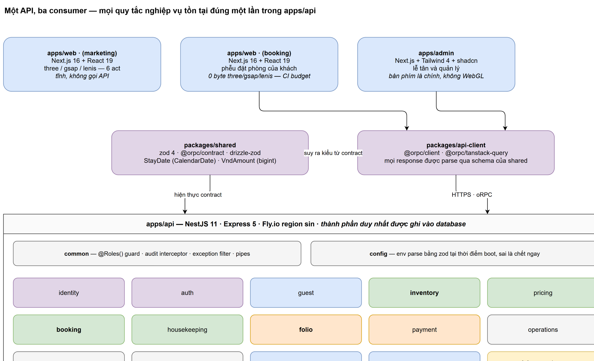

# Chương 4 — Thiết kế kiến trúc

## 4.1 Kiểu kiến trúc: modular monolith

Hệ thống là **một ứng dụng NestJS duy nhất**, chia mô-đun theo miền nghiệp vụ,
nói chuyện với **một cơ sở dữ liệu Postgres duy nhất**.

Đây là quyết định có chủ ý chứ không phải là chưa kịp tách. Lý do:

**Bất biến quan trọng nhất của hệ thống là một ràng buộc cơ sở dữ liệu.** Ràng
buộc `EXCLUDE USING gist` ở chương 5 §3 chỉ thực thi được bên trong một Postgres
duy nhất. Tách `inventory` và `booking` thành hai service với hai database là
vứt bỏ mục tiêu G1 và xây lại nó thành bài toán giải quyết xung đột phân tán —
đúng cái mà các khách sạn hay làm sai trên thực tế.

**Quy mô không đòi hỏi.** Bốn mươi buồng, một cơ sở. Một năm × năm loại buồng =
1.825 dòng tồn kho. Không có nút thắt cổ chai nào để tách ra cả.

**Một người viết.** Microservice mua được ranh giới nhóm, và ở đây không có
nhóm. Cái nó bán lại là chi phí vận hành, và người trả là cùng một người.

Ranh giới mô-đun vẫn được giữ nghiêm, chỉ là chúng được cưỡng chế bởi trình biên
dịch chứ không bởi mạng.

## 4.2 Một API, ba consumer



**Hình 4.1** — Kiến trúc hệ thống. Nguồn `.drawio`:
[`hinh/kien-truc-he-thong.drawio`](hinh/kien-truc-he-thong.drawio).

```
apps/
  api/       NestJS + Postgres. Mọi quy tắc nghiệp vụ. Thành phần DUY NHẤT ghi vào database
  admin/     Next.js. Quầy lễ tân và quản lý. Bàn phím là chính, không WebGL
  web/       Next.js. Origin công khai: trang marketing và phễu đặt phòng của khách
packages/
  shared/    zod schema và các kiểu suy ra từ chúng. Hợp đồng mà mọi app đều đọc
  api-client/ Wrapper fetch có kiểu, validate response bằng schema của `shared`
docs/        Kiến trúc, sơ đồ sinh tự động, bảng đối chiếu
plans/       Kế hoạch và báo cáo làm việc
```

Quy tắc trung tâm, phát biểu thẳng:

> Logic nghiệp vụ tồn tại **đúng một lần**, trong `apps/api`. Các frontend chỉ
> render nó và không làm gì khác. **Không** server action, route handler hay màn
> hình admin nào của Next.js được chạm trực tiếp vào database.

Đó là thứ biến một bộ não thành ba bộ não bất đồng với nhau. Cám dỗ rất cụ thể:
một truy vấn nhỏ ngay trong server component của Next.js "vì nó nhanh hơn". Sáu
tháng sau, quy tắc tính phạt huỷ tồn tại ở ba nơi với ba phiên bản khác nhau.

## 4.3 Quy tắc giữ cho kho mã không mục theo thời gian

Bốn quy tắc dưới đây là toàn bộ khác biệt giữa một `lib/` đọc được ở quy mô 30
màn hình và một `lib/` phải grep.

### 4.3.1 Phụ thuộc đi một chiều

```
app/ → features/ → components/ui/ + lib/ → packages/*
```

Không bao giờ đi ngược. Một tệp trong `components/ui/` mà import một feature là
vết nứt đầu tiên.

### 4.3.2 Một feature không import feature khác

Khi hai feature cần cùng một thứ, thứ đó **thăng cấp**: lên `components/ui/` nếu
nó thuần trình bày, lên `lib/` nếu nó là hạ tầng, lên `packages/shared` nếu nó
là hợp đồng.

Nguyên tắc kèm theo: **chép nó hai lần trước khi quyết định.** Một trừu tượng
hoá dùng chung sai tốn kém hơn một bản sao.

### 4.3.3 `lib/` là hạ tầng xuyên suốt, không phải ngăn kéo tạp

API client, truy cập biến môi trường, các hàm định dạng. Nếu một tệp nói về một
họ màn hình cụ thể, nó thuộc về feature đó.

Ví dụ đã thực hiện trong `apps/web`: `lib/` giữ đúng hai tệp mà một màn hình đặt
phòng cũng sẽ với tới — `motion-tokens` (nguồn duy nhất cho mọi ease, duration,
stagger) và `use-in-view` (hook IntersectionObserver tổng quát). Mọi thứ khác mà
trang marketing chạm tới — act store, manifest ảnh và video, Lenis provider, hình
học monogram, spring solver, WebGL probe — đã chuyển vào
`features/arrival/lib/`, vì **một consumer duy nhất không làm cho thứ gì đó trở
thành dùng chung**.

### 4.3.4 Mọi thứ đi qua mạng được khai báo một lần, trong `packages/shared`

Schema sống ở đó; cả hai phía **suy ra** kiểu từ đó. Một thay đổi contract phá
vỡ tương thích sẽ hiện ra dưới dạng lỗi kiểu ở hai app, chứ không phải một cái
nhún vai lúc runtime ở một app.

### 4.3.5 Bất biến sống trong database

Chồng lấn và bán vượt buồng được ngăn bởi **ràng buộc** trong
`apps/api/src/database/migrations/`, không phải bởi câu lệnh kiểm tra ở tầng
service. Mã ứng dụng không được phép là tuyến phòng thủ cuối cùng cho tiền hoặc
tồn kho.

Chương 5 §3 trình bày chi tiết cơ chế này.

## 4.4 Cấu trúc `apps/api`

```
src/
  main.ts, app.module.ts
  common/          Guard (@Roles), audit interceptor, exception filter, pipe
  config/          Parse và validate env, một schema, chết ngay lúc boot nếu sai
  database/
    schema/        Một tệp cho mỗi miền, re-export từ index.ts
    migrations/    SQL. Ràng buộc, extension và index nằm ở đây
  modules/<domain>/
  jobs/            Công việc theo lịch: night audit, quét hạn ảnh giấy tờ
test/              e2e và bộ test tương tranh
```

Một mô-đun là một thư mục: `x.module.ts`, `x.controller.ts`, `x.service.ts`,
`dto/`, và các `*.spec.ts` nằm ngay cạnh thứ chúng kiểm thử.

> **Bề mặt công khai của một mô-đun đúng bằng những gì NestJS module của nó
> export.**

Với tay vào bên trong mô-đun khác là cách một modular monolith biến thành mớ rối
cần microservice để giải thích. Đây là quy tắc thay thế cho ranh giới mạng mà
kiến trúc này cố tình không có.

Các tệp lược đồ được đặt tập trung dưới `database/schema/` vì migration cần một
điểm vào duy nhất, nhưng **mỗi tệp thuộc sở hữu của mô-đun mang tên nó**.

### 4.4.1 Bản đồ mô-đun

| Mô-đun | Sở hữu |
|---|---|
| `identity` | Nhân viên, vai trò, ma trận quyền |
| `auth` | Hai realm tách biệt: phiên nhân viên và tài khoản khách |
| `guest` | Hồ sơ khách, bản ghi và ảnh giấy tờ, hạng VIP, điểm tích luỹ |
| `inventory` | Loại buồng, buồng, tồn kho theo loại theo đêm, truy vấn phòng trống |
| `pricing` | Rate plan, rate calendar, hạn chế lưu trú, khuyến mãi |
| `booking` | Máy trạng thái vòng đời, giữ chỗ, gán buồng, huỷ |
| `housekeeping` | Tình trạng buồng, trực giao với tình trạng có khách; out-of-order |
| `folio` | Sổ bút toán chỉ-ghi-thêm, thuế, hoá đơn, bút toán đảo |
| `payment` | VNPay/MoMo, webhook idempotent, hoàn tiền, đối soát |
| `operations` | Bàn giao ca, két tiền mặt, danh mục dịch vụ, thu chi |
| `reporting` | Snapshot của night audit, công suất/ADR/RevPAR, xuất dữ liệu |
| `audit` | Nhật ký thay đổi mà mọi hành động đổi trạng thái đều ghi vào |
| `feedback` | Phản hồi sau lưu trú, gắn với một booking đã hoàn tất |
| `notification` | Email giao dịch và các mẫu của nó |

## 4.5 Cấu trúc `apps/admin`

```
app/
  (auth)/          Đăng nhập. Không shell, không nav
  (app)/           Shell đã xác thực: nav, command palette, hotkey
features/          Một thư mục cho mỗi họ màn hình
components/ui/     Primitive. Không biết gì về miền nghiệp vụ
lib/               API client, hạ tầng bàn phím và focus
```

Các họ màn hình dự kiến — dashboard, arrivals, departures, bookings, rooms,
housekeeping, guests, rates, folios, payments, reports, shifts, finance, audit,
settings — **cố tình chưa được scaffold**, vì tên của chúng sẽ dịch chuyển trước
khi miền nghiệp vụ dịch chuyển.

### 4.5.1 Tầng bàn phím là quyết định kiến trúc, không phải chuyện style

Command palette, global hotkey, quản lý focus, parse ngày kiểu tự do — tất cả
thuộc về `lib/` và layout `(app)`, và phải có mặt **trước khi** số màn hình nhân
lên.

Lý do đơn giản: gắn ngược "bàn phím là chính" lên hai mươi màn hình đã làm theo
lối chuột-là-chính không phải là refactor, đó là viết lại.

Cụ thể những gì được xây sớm ở P2:

- **Command palette (`cmdk`) là phương thức điều hướng chính.** `Ctrl+K` → "checkin 301", "folio 4821", "arrivals today".
- **Hotkey toàn cục** cho năm hành động chiếm đa số: tạo booking, nhận phòng, trả phòng, ghi phí, tìm khách.
- **Nhập ngày bằng chữ, không dùng date picker.** `1408` → 14 tháng 8. Parse rộng rãi, hiển thị cách hiểu ngay tại chỗ.
- **Quản lý focus tường minh** sau mỗi hành động. Làm sai điểm này khiến một UI nhanh *có cảm giác* chậm.
- **Máy quét CCCD/hộ chiếu là bàn phím giả lập** (gõ ký tự rồi Enter). Form phải hoạt động được ngay; đừng chỉ xây đường upload ảnh.

## 4.6 Cấu trúc `apps/web` và sự cô lập của `/booking`

```
app/
  (marketing)/     Trang marketing. three / gsap / lenis CHỈ sống trong nhánh này
  (booking)/       Phễu đặt phòng của khách. Bundle thuần
features/
  arrival/         Sáu act và toàn bộ máy móc WebGL chúng cần
components/ui/     Primitive dùng chung giữa các route group
lib/               Không biết miền nghiệp vụ và thực sự dùng chung. Hiện có hai tệp
```

Root layout chỉ mang document shell, font và token — **không gì khác**. Một
provider gắn ở đó sẽ nằm trong cây của mọi route, và đó chính xác là cách `three`
lọt vào đường chuyển đổi của khách hàng.

> **`/booking` phải ship 0 byte `three`, `gsap`, `lenis`.** Đó là một **ngân sách
> CI**, không phải một quy ước.

Một provider WebGL dùng chung đặt ở root layout làm đường đặt phòng nặng thêm
khoảng 400 kB một cách âm thầm. Ngân sách CI biến điều đó thành một build đỏ
thay vì một tỉ lệ chuyển đổi thấp mà không ai truy ra nguyên nhân.

Việc đặt `/booking` **cùng origin** với trang marketing cũng là quyết định có ý
thức: một origin, một cookie, không CORS cho xác thực khách, không phải phân
vùng cookie theo subdomain. Đơn giản hơn đúng ở chỗ mà lỗi xác thực hay sống.

### 4.6.1 Một chi tiết cấu hình đáng ghi

`next lint` chỉ duyệt `app`, `pages`, `components`, `lib` và `src`. Vì phần lớn
mã nằm trong `features/`, `eslint.dirs` trong `next.config.mjs` phải nêu tên
`features` một cách tường minh. Bỏ sót điều này thì phần lớn ứng dụng "lint
sạch" bằng cách không bao giờ được đọc tới.

Chi tiết nhỏ, nhưng nó là loại chi tiết khiến một cổng chất lượng trở thành trang
trí.

## 4.7 `packages/`

`shared` chỉ chứa **hợp đồng**: zod schema và kiểu suy ra, không phụ thuộc
runtime nào ngoài zod, không import framework. Chính cái tên khiến nó trở thành
nơi hấp dẫn nhất kho mã để vứt một hàm tiện ích vào — cưỡng lại điều đó, và hợp
đồng còn đáng tin.

`api-client` bọc fetch, chèn thông tin xác thực, và parse mọi response qua schema
của `shared`. Cả hai frontend đều tiêu thụ nó.

**Chưa có `packages/ui` và cũng chưa nên có.** Trang marketing, phễu đặt phòng và
console quản trị có ngôn ngữ thị giác thực sự khác nhau; một `packages/ui` phục
vụ cả ba sẽ là một trừu tượng hoá mẫu-số-chung-nhỏ-nhất không có consumer thứ hai
thật sự. Xem lại khi nào xuất hiện một cái.

## 4.8 Trạng thái hiện tại của kho mã

Ghi trung thực để chương 9 có mốc so sánh.

| Bề mặt | Trạng thái |
|---|---|
| `apps/web` | **Có mã thật.** Trang marketing scrollytelling. Đã lên React 19.2 + Next 16.2 + R3F 9.6 sau một Playwright visual baseline đã commit; phần còn lại của P−1 là `packages/tokens`, Biome và lefthook |
| `apps/api` | Chỉ có README và cây thư mục đã đặt chỗ. Chưa có `package.json` |
| `apps/admin` | Chỉ có README và cây thư mục đã đặt chỗ |
| `packages/shared` | Chỉ có `zod ^4.4.3` |
| `packages/api-client` | `src/` rỗng |
| Toolchain | pnpm 11.1.2, Turborepo 2.10.7, TypeScript 5.6.3, Node ghim 24 (`.nvmrc` + `engines` + CI) |
| CI | Đọc `.nvmrc`, chạy lint + typecheck + build. **Chưa có test** |

Các thư mục chỉ chứa `.gitkeep` là **ranh giới đã đặt chỗ** — công việc lấp đầy
chúng chưa bắt đầu. Việc đặt chỗ trước có mục đích: khi `apps/api` được scaffold
ở P0, nó rơi vào một cấu trúc đã được quyết định thay vì đẻ ra một cấu trúc mới.
