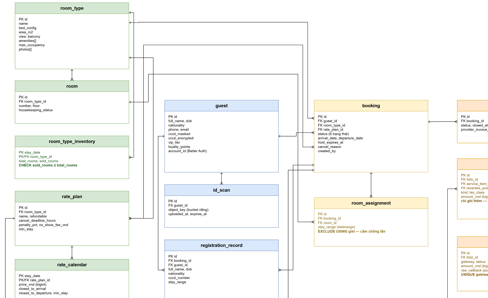
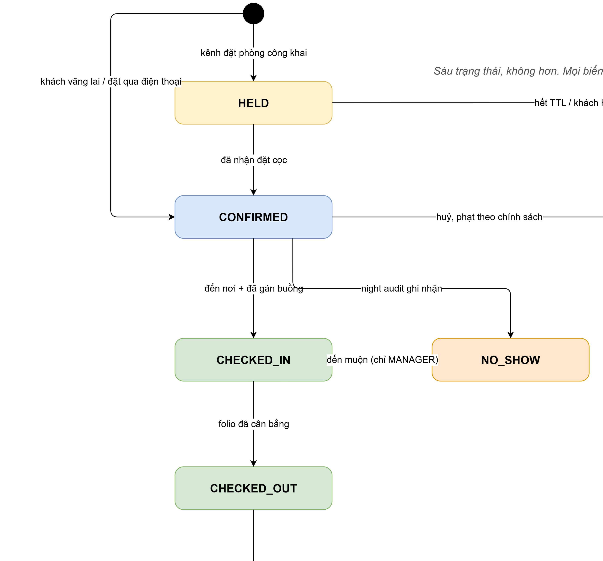
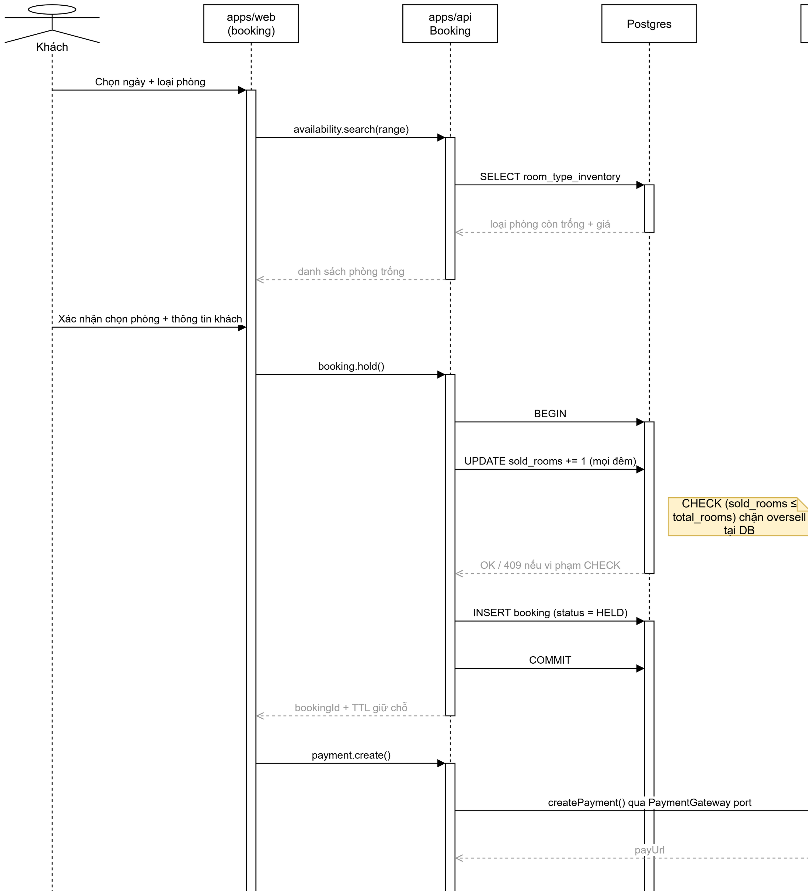
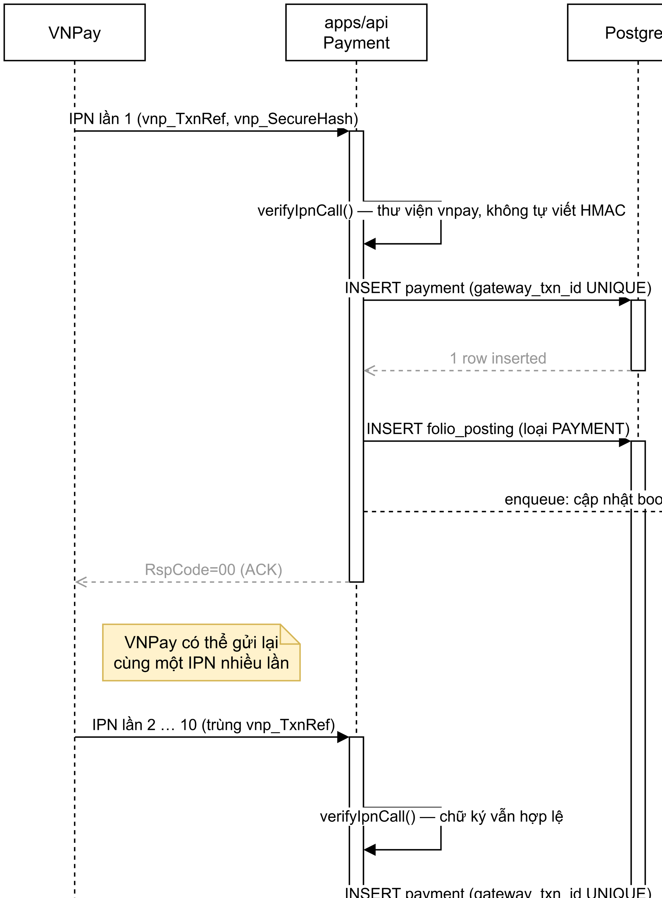
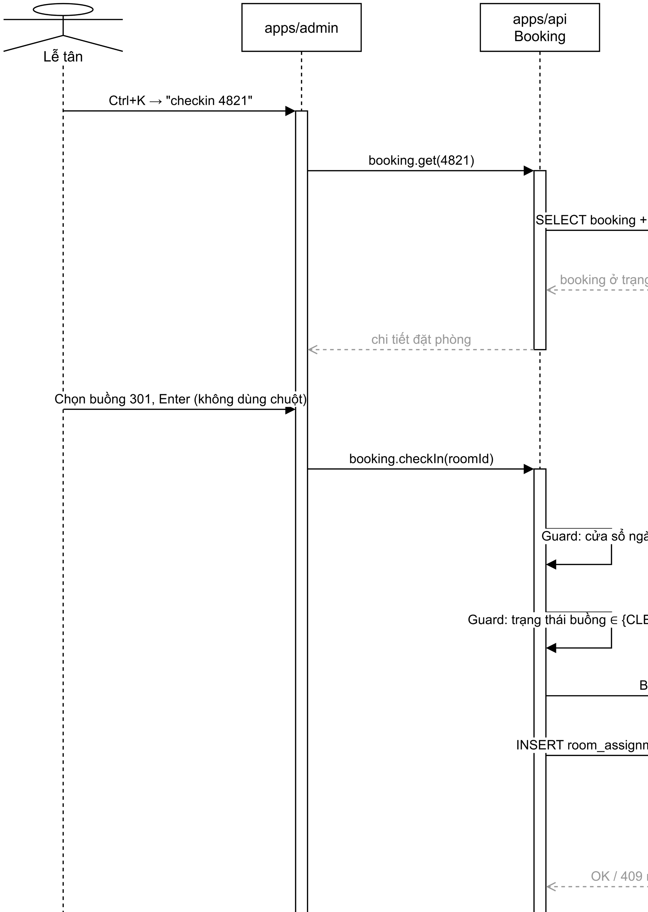
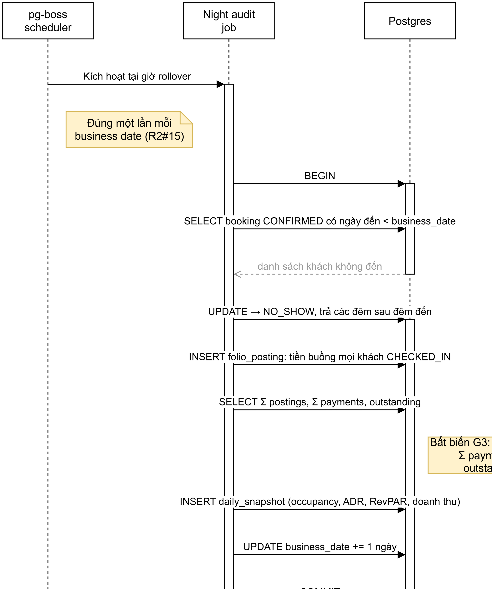

# Chương 5 — Thiết kế chi tiết

> ⛔ **OUTDATED / KHÔNG TIN CẬY — đánh dấu 2026-08-01.** Toàn bộ `docs/bao-cao/`
> đã trôi khỏi mã nguồn và tài liệu canonical. Không trích dẫn tệp này làm nguồn,
> không sửa mã hay tài liệu theo nó, không coi nó là bằng chứng đã triển khai.
> Lấy sự thật từ [`docs/README.md`](../README.md) (bản đồ thẩm quyền) rồi tới mã
> nguồn, test, schema và workflow CI. Chỉ viết lại chương này khi đang chủ động
> biên soạn báo cáo, và chỉ bằng bằng chứng đọc trực tiếp.
> *(EN: this coursework report is stale and untrusted — do not use it as a source
> of truth for the codebase.)*

## 5.1 Năm bất biến

Năm điều dưới đây được nướng vào lược đồ từ ngày đầu. Chúng không phải quy ước
lập trình; chúng là những mệnh đề mà hệ thống không được phép vi phạm.

| # | Bất biến | Được cưỡng chế bởi |
|---|---|---|
| 1 | **Ngày lưu trú là ngày, sự kiện là thời điểm** | Kiểu dữ liệu: `date` vs `timestamptz`; ở tầng TypeScript là `CalendarDate` vs `ZonedDateTime` — **lỗi biên dịch** |
| 2 | **Tiền là số nguyên VND (`bigint`)** | Kiểu cột. Thuế và phí phục vụ là dòng bút toán riêng, không bao giờ nướng vào tổng |
| 3 | **Folio chỉ ghi thêm** | Không có đường `UPDATE`/`DELETE` nào tồn tại. Sửa hoá đơn = bút toán đảo + bút toán đúng |
| 4 | **Trạng thái booking trực giao với trạng thái buồng phòng** | Hai cột, hai enum. Buồng có thể `VACANT`+`DIRTY` (không bán được) hoặc `OCCUPIED`+`CLEAN` |
| 5 | **Night audit là một job, không phải một báo cáo** | pg-boss. Mọi báo cáo đọc từ snapshot bất biến |

Bất biến 1 đáng nói thêm: trộn ngày lưu trú với thời điểm là nguồn số một của
lỗi lệch một đêm trong phần mềm khách sạn. Cơ sở neo múi giờ ở
`Asia/Ho_Chi_Minh`. Việc chọn `@internationalized/date` (chương 3 §3.5) biến quy
ước này thành thứ trình biên dịch từ chối, thay vì thứ một test có thể quên.

Bất biến 4 là cái bẫy kinh điển: gộp hai trạng thái vào một enum. Khách trả
phòng lúc 11 giờ không làm buồng đó bán được lúc 11 giờ 01.

## 5.2 Mô hình dữ liệu



**Hình 5.1** — ERD thiết kế. Nguồn `.drawio`: [`hinh/erd.drawio`](hinh/erd.drawio).

> ⚠ **Đây là ERD *thiết kế*, chưa phải ERD *sinh từ lược đồ sống*.** Lược đồ
> hiện tại đã tồn tại cho identity và guest auth tại
> `apps/api/src/database/schema/index.ts`, cùng các migration đã commit, nhưng
> chưa có lược đồ inventory/booking/folio mà hình này mô tả.
> `docs/erd.dbml` và cổng kiểm tra trôi cũng chưa tồn tại. Vì vậy hình này là
> ý định thiết kế, không phải bằng chứng release.
>
> Lý do nói thẳng điều này: một ERD trôi khỏi lược đồ còn tệ hơn không có ERD
> nào, và người chấm chỉ mất ba mươi giây để phát hiện sự không khớp.

Thiết kế dự kiến chia thực thể thành các nhóm: buồng và giá, khách và định danh,
đặt phòng, sổ sách, vận hành và báo cáo.

## 5.3 Tồn kho hai tầng — tường chịu lực

Đây là phần thiết kế quan trọng nhất của toàn hệ thống.

### 5.3.1 Tầng 1 — tồn kho theo loại theo đêm (thứ được bán)

```sql
create table room_type_inventory (
  stay_date    date not null,
  room_type_id uuid not null references room_type(id),
  total_rooms  int  not null,           -- số buồng vật lý trừ đi buồng đóng
  sold_rooms   int  not null default 0,
  primary key (stay_date, room_type_id),
  constraint no_oversell check (sold_rooms <= total_rooms)
);
```

Một lần đặt phòng là **một transaction** tăng `sold_rooms` cho mọi đêm trong kỳ
lưu trú. Câu `CHECK` chính là bảo đảm chống đặt trùng: hai yêu cầu đồng thời cho
buồng cuối cùng thì một cái **thất bại ngay tại database**. Khoá dòng của
Postgres tuần tự hoá chúng; không cần khoá ở tầng ứng dụng, và không có cửa sổ
tương tranh nào.

### 5.3.2 Tầng 2 — gán buồng cụ thể lúc nhận phòng (thứ được vận hành)

```sql
create extension if not exists btree_gist;

alter table room_assignment add constraint room_never_double_occupied
  exclude using gist (
    room_id    with =,
    stay_range with &&          -- daterange, biên '[)'
  ) where (status in ('ASSIGNED','CHECKED_IN'));
```

Việc hai khách cùng ở một buồng trong những đêm chồng lấn trở thành **bất khả
biểu diễn**. Không phải *được kiểm tra* — mà là *không thể ghi vào bảng*.

### 5.3.3 Vì sao phải hai tầng

Khách đặt "một Deluxe cho 3 đêm", không đặt "buồng 301". Gán buồng cụ thể ngay
lúc đặt biến mọi lần đổi buồng, mọi lần đóng buồng bảo trì và mọi lần nâng hạng
thành một cuộc khủng hoảng thủ công.

Cái giá là P1 phức tạp hơn và **sẽ cảm giác chậm**. Đó là sự chậm đúng chỗ.

### 5.3.4 Nghĩa vụ kiểm thử đi kèm

Test tương tranh phải được viết **trước** giao diện đặt phòng, không phải sau:

> `P1-INV-05` — 50 yêu cầu đặt phòng song song trên buồng cuối cùng → **đúng 1**
> thành công, **49** lần trả 409 sạch sẽ, **0** lần bán vượt. Chạy trong CI.

## 5.4 Máy trạng thái đặt phòng



**Hình 5.2** — Máy trạng thái đặt phòng. Nguồn có thẩm quyền:
[`docs/architecture/booking-state-machine.md`](../architecture/booking-state-machine.md).
Tại `P0-DOC-04` hình này được sinh lại từ bảng ở §2 của tài liệu đó.
Nguồn `.drawio`: [`hinh/state-machine.drawio`](hinh/state-machine.drawio).

### 5.4.1 Sáu trạng thái

| Trạng thái | Ý nghĩa | Tồn kho | Đã gán buồng |
|---|---|---|---|
| `HELD` | Giỏ hàng hoặc giữ chỗ tạm, TTL đang chạy | Chiếm, mọi đêm | Không |
| `CONFIRMED` | Đã nhận cọc hoặc nhân viên xác nhận | Chiếm, mọi đêm | Tuỳ chọn |
| `CHECKED_IN` | Khách đang ở | Chiếm, các đêm còn lại | **Có** |
| `CHECKED_OUT` | Kết thúc lưu trú, folio đã đóng | Chiếm các đêm đã ở | Lịch sử |
| `CANCELLED` | Kết thúc, đã không diễn ra | Trả lại | Không |
| `NO_SHOW` | Qua đêm đến mà không nhận phòng | Giữ đêm đến, trả phần còn lại | Không |

### 5.4.2 Bảng chuyển trạng thái

`✔` hợp lệ, `✘` bị từ chối với `409 IllegalTransition`.

| Từ ↓ Tới → | `HELD` | `CONFIRMED` | `CHECKED_IN` | `CHECKED_OUT` | `CANCELLED` | `NO_SHOW` |
|---|:-:|:-:|:-:|:-:|:-:|:-:|
| *(mới)* | ✔ | ✔ | ✘ | ✘ | ✘ | ✘ |
| `HELD` | — | ✔ | ✘ | ✘ | ✔ | ✘ |
| `CONFIRMED` | ✘ | — | ✔ | ✘ | ✔ | ✔ |
| `CHECKED_IN` | ✘ | ✘ | — | ✔ | ✘ | ✘ |
| `CHECKED_OUT` | ✘ | ✘ | ✘ | — | ✘ | ✘ |
| `CANCELLED` | ✘ | ✘ | ✘ | ✘ | — | ✘ |
| `NO_SHOW` | ✘ | ✘ | ✔ | ✘ | ✘ | — |

### 5.4.3 Vì sao không có trạng thái `EXPIRED`

Một hold bị bỏ rơi và một lần khách chủ động huỷ khác nhau ở **lý do**, không
khác ở việc hệ thống phải làm gì. Cả hai đều trả lại tồn kho và kết thúc booking.

`CANCELLED` mang một reason code — `HOLD_EXPIRED`, `GUEST_REQUEST`,
`STAFF_ERROR`, `PAYMENT_FAILED`, `OVERBOOK_WALK`, `FORCE_MAJEURE` — và chính
reason quyết định mức phạt, không phải trạng thái. Thêm trạng thái thứ bảy không
mua được gì và nhân đôi bảng chuyển trạng thái.

### 5.4.4 Tác động của mỗi lần chuyển trạng thái

| Chuyển | Tồn kho | Tiền | Khác |
|---|---|---|---|
| → `HELD` | `sold_rooms += 1` mỗi đêm | Không | Khởi động đồng hồ TTL |
| `HELD` → `CONFIRMED` | Không đổi | Ghi cọc nếu có thu | Email xác nhận |
| `HELD` → `CANCELLED` | Trả toàn bộ đêm | Hoàn cọc nếu có | Reason `HOLD_EXPIRED` khi job TTL kích hoạt |
| `CONFIRMED` → `CANCELLED` | Trả toàn bộ đêm | Phạt theo chính sách, hoàn phần dư | **Bắt buộc** có reason code |
| `CONFIRMED` → `CHECKED_IN` | Không đổi | Tiền buồng đêm đầu do night audit ghi, **không** ghi lúc nhận phòng | Bắt buộc đã gán buồng; ghi bản ghi lưu trú |
| `CONFIRMED` → `NO_SHOW` | Trả các đêm **sau** đêm đến | Phí no-show theo chính sách | Do night audit ghi |
| `CHECKED_IN` → `CHECKED_OUT` | Trả các đêm chưa ở | Folio phải cân; job hoá đơn được xếp hàng | Buồng → `DIRTY` |
| `NO_SHOW` → `CHECKED_IN` | Chiếm lại các đêm còn lại, thất bại nếu hết chỗ | Đảo phí no-show | Chỉ `MANAGER` |

### 5.4.5 Guard — những lần từ chối không liên quan tới cặp trạng thái

| Guard | Áp dụng cho | Từ chối khi |
|---|---|---|
| Cửa sổ ngày đến | → `CHECKED_IN` | Business date < ngày đến và nhận phòng sớm bị tắt ⚑, hoặc business date > ngày đi |
| Bắt buộc có buồng | → `CHECKED_IN` | Chưa gán, hoặc gán vi phạm ràng buộc `EXCLUDE USING gist` |
| Buồng sẵn sàng | → `CHECKED_IN` | Trạng thái buồng phòng không phải `CLEAN` hoặc `INSPECTED` ⚑ |
| Folio đã tất toán | → `CHECKED_OUT` | Số dư ≠ 0 và không có phê duyệt trả chậm |
| Còn tồn kho | → `HELD`, → `CONFIRMED`, gia hạn, phục hồi | `sold_rooms > total_rooms` — cưỡng chế bởi `CHECK`, lộ ra dưới dạng `409` |
| Idempotency | mọi lần chuyển | Cùng một lần chuyển đã được áp dụng; trả về trạng thái hiện tại, **không** báo lỗi |

### 5.4.6 Thao tác không đổi trạng thái

Đây là nơi phần lớn công việc thật của quầy lễ tân diễn ra. Mỗi thao tác là một
endpoint riêng với khai báo năng lực riêng.

| Thao tác | Hợp lệ ở | Ghi chú |
|---|---|---|
| Gán / đổi buồng | `CONFIRMED`, `CHECKED_IN` | Không bao giờ dời một khách đã nhận phòng khác |
| Chuyển buồng | `CHECKED_IN` | Dòng gán mới; dòng cũ đóng lại ở ngày hôm nay |
| Gia hạn lưu trú | `CONFIRMED`, `CHECKED_IN` | Cần tồn kho cho các đêm thêm; thất bại sạch sẽ |
| Rút ngắn / trả sớm | `CHECKED_IN` | Trả lại đêm, ghi phí trả sớm |
| Nâng hạng buồng | `CONFIRMED`, `CHECKED_IN` | Tồn kho chuyển giữa các loại một cách nguyên tử |
| Đổi giá | `CONFIRMED`, `CHECKED_IN` | Thấp hơn giá của rate plan: chỉ `MANAGER` |
| Ghi phí / ghi thanh toán | `CHECKED_IN`, `CONFIRMED` | Tiền cọc ghi trước ngày đến |

## 5.5 Biểu đồ tuần tự

Bốn luồng dưới đây là bốn chỗ mà thiết kế phải chứng minh nó đúng.

### 5.5.1 Giữ chỗ và xác nhận đặt phòng



**Hình 5.3** — Nguồn: [`hinh/seq-1-hold-confirm.drawio`](hinh/seq-1-hold-confirm.drawio).

Điểm cần chú ý là chỗ câu `CHECK` nằm: **bên trong transaction, tại database**.
Tầng service không hỏi "còn chỗ không?" rồi mới ghi — nó cứ ghi, và để ràng buộc
từ chối. Đó là khác biệt giữa một hệ thống không có cửa sổ tương tranh và một hệ
thống có cửa sổ tương tranh rất hẹp mà không test nào bắt được.

### 5.5.2 Tính idempotent của webhook thanh toán



**Hình 5.4** — Nguồn: [`hinh/seq-2-ipn.drawio`](hinh/seq-2-ipn.drawio).

VNPay **có thể gửi lại cùng một IPN nhiều lần** — đây là hành vi đã được xác
minh, không phải một giả định phòng thủ. Ràng buộc `UNIQUE` trên
`gateway_txn_id` là bắt buộc. Khi gặp lỗi trùng khoá, hệ thống coi như đã xử lý,
**không** ghi sổ lần hai, và vẫn **ACK thành công** cho gateway — báo lỗi về sẽ
khiến gateway thử lại mãi.

Chữ ký được xác minh bằng `verifyIpnCall` của thư viện `vnpay`. Việc tự sắp xếp
tham số và tự tính HMAC-SHA512 là nơi ai cũng ship một lỗi chữ ký đúng một lần.

Chỉ tiêu: phát lại một callback **10 lần** → **1** payment được ghi nhận.

### 5.5.3 Nhận phòng và gán buồng



**Hình 5.5** — Nguồn: [`hinh/seq-3-checkin.drawio`](hinh/seq-3-checkin.drawio).

Toàn bộ luồng hoàn thành **không có sự kiện chuột nào**. Chi tiết dễ bị bỏ qua
là dòng cuối: trả focus về ô nhập kế tiếp trong vòng 150 ms. Làm sai điểm đó
khiến một hệ thống nhanh có cảm giác chậm.

Tiền buồng đêm đầu tiên **không** được ghi lúc nhận phòng — night audit ghi nó
(§5.5.4). Ghi sớm là cách tạo ra bút toán trùng khi khách đến rồi lại huỷ trong
cùng ngày.

### 5.5.4 Night audit và chốt ngày làm việc



**Hình 5.6** — Nguồn: [`hinh/seq-4-night-audit.drawio`](hinh/seq-4-night-audit.drawio).

Night audit chạy **đúng một lần cho mỗi business date**, chứng minh được từ lịch
sử pg-boss. Nó ghi tiền buồng, đánh dấu no-show, khẳng định bất biến G3, ghi
snapshot bất biến, rồi đẩy business date.

Nó **không** phát hành hoá đơn điện tử — xem §5.7.

Một job chốt sổ hỏng mà im lặng là chế độ lỗi tệ nhất trong hệ thống này. Vì thế
job check-in vào một heartbeat monitor; không nhận được heartbeat thì điện thoại
đổ chuông trong vòng 30 phút.

## 5.6 Folio — sổ chỉ ghi thêm

Mỗi booking có một folio; mỗi folio là một chuỗi bút toán **chỉ ghi thêm**.

| Loại bút toán | Ví dụ |
|---|---|
| `CHARGE` | Tiền buồng một đêm, dịch vụ giặt là, minibar |
| `TAX` | VAT — **dòng riêng**, không nướng vào tiền buồng |
| `SERVICE_CHARGE` | Phí phục vụ — **dòng riêng** |
| `PAYMENT` | Đặt cọc, thanh toán thẻ, tiền mặt |
| `REFUND` | Hoàn tiền |
| `REVERSAL` | Bút toán đảo, trỏ tới bút toán mà nó đảo |

**"Sửa/xoá hoá đơn" = bút toán đảo + bút toán đúng.** Không bao giờ là `UPDATE`,
không bao giờ là `DELETE`. Điều này cho yêu cầu số 9 (nhật ký kiểm toán) gần như
miễn phí và khiến mục tiêu G3 chứng minh được.

Nghiệp vụ *hoá đơn điều chỉnh / thay thế* của Việt Nam ánh xạ thẳng lên mô hình
đảo bút toán này. Không cần khái niệm mới nào.

> **Chưa chốt:** thứ tự áp thuế — VAT có tính trên phí phục vụ hay không — quyết
> định mọi tổng tiền trong hệ thống. Đây là quyết định `D2`, thuộc về kế toán, và
> tình trạng thuế suất ưu đãi có tính thời điểm. Báo cáo **không** ghi một con số
> phỏng đoán ở đây; thuế suất, thời hạn áp dụng và tax-base mode đều là cấu hình
> từ ngày đầu, chờ kế toán trả lời bằng văn bản.

Quy tắc giá giữa **người thêm** và **giường phụ** cũng chưa chốt: chủ đầu tư phải
xác nhận khi nào giường phụ là bắt buộc và dòng dịch vụ đó cộng dồn hay thay thế
phí người thêm. Thiết kế folio giữ được hai dòng riêng; công thức báo giá không
được tự suy ra câu trả lời.

## 5.7 Hoá đơn điện tử — quy định định hình thiết kế

**Nghị định 70/2025/NĐ-CP** có các quy định về hoá đơn điện tử khởi tạo từ máy
tính tiền và nêu *khách sạn*. Tuy nhiên, việc các quy định đó có áp dụng cho
pháp nhân và mã ngành vận hành Mariva hay không vẫn chờ đại lý thuế trả lời bằng
văn bản (`M0-06`).

Nếu được xác nhận áp dụng, thiết kế đích có các hệ quả sau:

1. Mua **đúng sản phẩm "từ máy tính tiền"**, không phải HĐĐT thông thường. Cùng nhà cung cấp, khác SKU và khác API.
2. **Màn hình trả phòng chính là máy tính tiền.** Hoá đơn phát hành khi folio đóng, trước mặt khách — không phải trong night audit.
3. Điều đó **không** có nghĩa là gọi đồng bộ trong HTTP request. Hình dạng đúng: folio đóng → xếp hàng một job pg-boss **idempotent khoá theo folio id** → job ký và phát hành → màn hình subscribe và hiển thị kết quả sau vài giây. Một lần timeout của nhà cung cấp **không bao giờ** được phép rollback một lần trả phòng đã hoàn tất.
4. **Số hoá đơn là của nhà cung cấp, không phải của ta.** Lưu số của họ cạnh folio id và dùng số của họ làm tham chiếu pháp lý trên mọi báo cáo.

> ⚠ **Nếu luồng máy tính tiền được xác nhận, phải mua chữ ký số HSM / ký số từ
> xa — không dùng USB token.**
>
> Ký tự động từ máy chủ cloud đòi hỏi khoá ký nằm trong HSM có API (ký số từ xa
> xác thực bằng JWT), không nằm trên một dongle. Nếu mua nhầm chứng thư dạng USB
> token — thứ mặc định mà nhà cung cấp bán cho một công ty mới — thì **việc phát
> hành hoá đơn tự động là bất khả thi**: sẽ có người cắm dongle vào một máy tính
> Windows cụ thể cho mỗi lần trả phòng, và PMS biến thành một giao diện nhập liệu
> cho cổng thông tin của nhà cung cấp.
>
> Quyết định này được đưa ra **nhiều tháng trước dòng mã đầu tiên** và rất khó
> đảo ngược giữa kỳ hạn chứng thư.

Nếu đại lý thuế kết luận không áp dụng, loại hoá đơn, thời điểm phát hành và
luồng nhà cung cấp phải được thay bằng đúng kết luận đó trước khi viết mã hoặc
mua sản phẩm.

## 5.8 Bảo vệ dữ liệu giấy tờ tuỳ thân

Một thứ được tách làm hai, vì chúng là hai lớp dữ liệu với hai động lực lưu trữ
khác nhau.

| Lớp | Nội dung | Động lực | Thời gian lưu |
|---|---|---|---|
| **Ảnh chụp giấy tờ** | JPEG/PNG của CCCD/hộ chiếu | Phục vụ vận hành — chứng minh danh tính *đã từng* được xác minh | **`N` ngày sau khi trả phòng**, xoá cứng bằng lifecycle rule; `N` chờ tư vấn pháp lý bằng văn bản |
| **Bản ghi lưu trú** | Họ tên, ngày sinh, quốc tịch, số CCCD, ngày lưu trú | Nghĩa vụ pháp lý — luật cư trú và luật kế toán | Mức sàn luật định theo tư vấn pháp lý bằng văn bản |

Ảnh và bản ghi có mục đích, rủi ro và nghĩa vụ lưu trữ khác nhau nên không được
gom vào một thời hạn suy đoán. Mục tiêu là thời hạn ngắn nhất vẫn đáp ứng nhu
cầu vận hành và mức sàn pháp lý đã được luật sư xác nhận.

**Quy tắc có thể bảo vệ được:** `thời gian lưu = max(nhu cầu vận hành, mức sàn
pháp lý)`, đánh giá **theo từng lớp dữ liệu**, lý do ghi rõ cho từng lớp. Một
khung như vậy sống sót qua kiểm tra; một con số trần trụi thì không.

**Ai cưỡng chế N:**

- **Cưỡng chế** là lifecycle rule của bucket R2. Không phải một cron job có thể quên deploy.
- **Kiểm chứng** là một job theo lịch khẳng định không đối tượng nào cũ hơn N ngày. Nó chứng minh rule hoạt động; nó không làm việc xoá.
- **N được khai báo một lần.** Nếu ứng dụng cũng giữ một hằng số thời gian lưu, hai giá trị sẽ trôi khỏi nhau và bucket sẽ thắng một cách âm thầm.
- Ảnh giấy tờ nằm trong **bucket riêng**, không bao giờ chung với ảnh phòng.

Truy cập chỉ qua presigned GET ngắn hạn, cấp bởi API **sau** khi kiểm tra vai
trò, và **chính việc cấp URL** là thứ được ghi nhật ký — không phải việc tải về.

> **Chưa chốt:** `N`, mức sàn cho bản ghi lưu trú, và việc lưu dữ liệu CCCD ở
> Singapore có hợp lệ hay không. Tất cả đang chờ luật sư trả lời bằng văn bản
> (`M0-05`). Vì vậy `N` là **giá trị cấu hình**, không phải hằng số.

## 5.9 Contract API

Thiết kế đã chấp nhận đặt router `@orpc/contract` trong `packages/shared`, từ đó
sinh binding server, client có kiểu và OpenAPI. Cổng kỹ thuật `G1` đã xác nhận
`@orpc/nest` cưỡng chế các sai lệch quan trọng ở mức biên dịch; bằng chứng quyết
định nằm tại
[`docs/architecture/tech-stack.md`](../architecture/tech-stack.md).

Bằng chứng hiện tại hẹp hơn thiết kế: `packages/shared/src/index.ts` đang export
các primitive/codec ngày và tiền; `apps/api` đã tồn tại nhưng các route hiện tại
vẫn là Nest controller; router oRPC, `packages/api-client` và
`docs/openapi.json` chưa tồn tại.

Hai kiểu nguyên thuỷ của contract:

| Kiểu | Hiện thực | Mục đích |
|---|---|---|
| `StayDate` | `CalendarDate` | Trộn một ngày lưu trú với một timestamp là **lỗi biên dịch** |
| `VndAmount` | `bigint` | Không float ở bất kỳ đâu trên đường đi của tiền |

> 🔶 **Chưa có artifact OpenAPI sinh tự động.** Khi generator tồn tại, artifact
> và cấu hình phục vụ nó là bằng chứng; báo cáo **không** liệt kê một danh sách
> endpoint viết tay có nguy cơ trôi.
